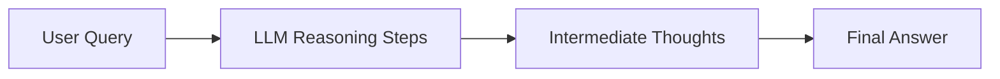

# Chain of Thought (CoT)

## Overview

Chain of Thought (CoT) is a prompting technique where a model is encouraged to break down reasoning into intermediate steps before producing a final answer.

Instead of directly answering a question, the model generates a **step-by-step reasoning process**.

---

## Why Chain of Thought is Useful

LLMs often struggle with:

- multi-step reasoning
- arithmetic or logic problems
- structured decision-making
- maintaining intermediate state

CoT improves performance by making reasoning explicit.

---

## Core Idea

Instead of:

```
Input → Output
```

We use:

```
Input → Reasoning Steps → Output
```

---

## Example

### Question:
```
If a train travels 60 km/h for 3 hours, how far does it go?
```

---

### Without CoT:
```
180 km
```

---

### With CoT:

```
Speed = 60 km/h
Time = 3 hours

Distance = Speed × Time
Distance = 60 × 3 = 180 km
```

Final Answer: 180 km

---

## How Chain of Thought Works



---

## Types of Chain of Thought

### 1. Zero-shot CoT

Model is prompted with:

```
Let’s think step by step.
```

No examples needed.

---

### 2. Few-shot CoT

Model is given examples with reasoning steps.

Example:

```
Q: ...
A: Step-by-step reasoning...
```

---

### 3. Self-consistency CoT

- Generate multiple reasoning paths
- Pick most consistent answer

Improves accuracy for complex tasks.

---

## Why CoT Improves Performance

Chain of Thought helps because:

- breaks complex tasks into smaller steps
- reduces cognitive load per step
- makes reasoning traceable
- improves arithmetic and logic accuracy

---

## Chain of Thought vs ReAct

| Chain of Thought | ReAct |
|-----------------|------|
| Internal reasoning | External tool use |
| No environment interaction | Uses tools + observations |
| Single model pass | Multi-step loop |
| No real-world grounding | Grounded in external data |

---

## Chain of Thought vs Reflection

| CoT | Reflection |
|-----|-----------|
| Produces reasoning steps | Evaluates reasoning |
| One-pass generation | Iterative improvement |
| No self-critique | Explicit critique loop |

---

## Chain of Thought vs Plan & Execute

| CoT | Plan & Execute |
|----|----------------|
| Step-by-step reasoning | Structured task decomposition |
| No explicit execution phase | Separate planning + execution |
| Internal thoughts only | External actions included |

---

## When to Use Chain of Thought

Use CoT for:

- math problems
- logic reasoning
- explanation generation
- multi-step QA
- debugging explanations

---

## When NOT to Use CoT

Avoid exposing CoT when:

- latency is critical
- reasoning is simple
- output must be concise
- production safety constraints exist

---

## Production Note (Important)

In real systems:

> You often do NOT expose full chain-of-thought to users.

Instead:
- reasoning is used internally
- final answer is returned
- intermediate steps are hidden or summarized

---

## Variants in Production Systems

### 1. Hidden CoT

Model reasons internally but only outputs final answer.

---

### 2. Structured CoT

Reasoning is formatted:

```
Step 1:
Step 2:
Final Answer:
```

---

### 3. Tool-Augmented CoT

CoT combined with:
- search
- calculators
- vector DBs

This overlaps with ReAct.

---

## Example in AI Systems

### Customer Support Bot

User:
```
Why was my transaction declined?
```

CoT reasoning:
- check account status
- check fraud rules
- check limits

Final output:
- concise explanation without exposing internal reasoning

---

## Benefits

- improves reasoning accuracy
- reduces hallucination in multi-step tasks
- helps debugging model behavior
- improves explainability internally

---

## Limitations

### 1. Not always reliable
LLM can still produce wrong reasoning steps

---

### 2. Can increase token usage
More tokens = higher cost

---

### 3. Not always necessary
Simple tasks don’t benefit from CoT

---

### 4. May leak sensitive reasoning if exposed
In production, reasoning is often hidden

---

## Interview Answer (30 sec)

> Chain of Thought is a prompting technique where the model is encouraged to generate intermediate reasoning steps before producing the final answer. It improves performance on complex reasoning tasks by breaking them into smaller, structured steps.

---

## Interview Answer (2 min)

Chain of Thought is a technique that improves LLM reasoning by encouraging the model to produce intermediate steps before giving the final answer. This helps the model decompose complex problems into simpler reasoning steps, improving accuracy in tasks like math, logic, and multi-step reasoning.

It can be implemented using zero-shot prompts like “let’s think step by step” or through few-shot examples. More advanced variants include self-consistency, where multiple reasoning paths are generated and the most consistent answer is selected.

In production systems, chain of thought is often used internally but not exposed to users, and is sometimes combined with tools in systems like ReAct.

---

## Common Follow-up Questions

### Is Chain of Thought always visible?

No. In production, reasoning is usually hidden or summarized.

---

### How is CoT different from ReAct?

CoT is internal reasoning; ReAct includes external tool usage.

---

### Does CoT guarantee correct answers?

No, it improves reasoning but does not guarantee correctness.

---

### When should CoT not be used?

When tasks are simple, latency-sensitive, or require concise outputs.

---

## References

- Chain-of-Thought Prompting (Wei et al., 2022)
- Self-Consistency Improves Chain of Thought Reasoning
- Google / DeepMind reasoning research papers
