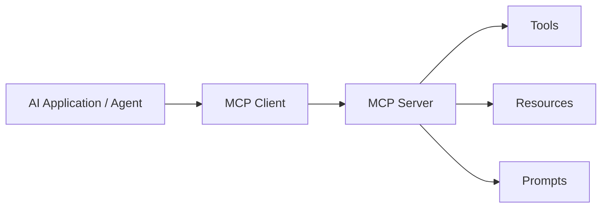
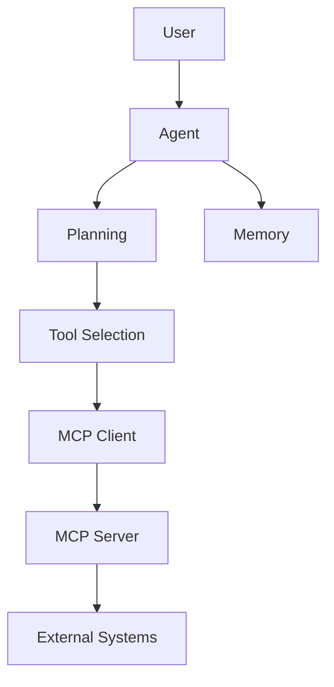

# Model Context Protocol (MCP)

## Overview

Model Context Protocol (MCP) is an open standard that enables LLM applications and AI agents to securely connect with external tools, data sources, and services.

MCP provides a common interface between:

- AI applications
- Models
- Tools
- Data sources
- Enterprise systems

Instead of building custom integrations for every tool, MCP standardizes how agents discover and use external capabilities.

---

# Why MCP Was Created

Traditional AI integrations require custom implementations.

Example:

Without MCP:

```
AI Agent

 |
 +-- Custom GitHub Integration
 |
 +-- Custom Jira Integration
 |
 +-- Custom Database Connector
 |
 +-- Custom Slack Connector
```

Every tool requires:

- Custom APIs
- Authentication logic
- Data formatting
- Error handling

---

With MCP:

```
AI Agent

↓

MCP Client

↓

MCP Server

↓

Tools / Resources / Data
```

A single protocol works across many integrations.

---

# MCP Architecture



---

# Core Components

## 1. MCP Host

The application where the AI experience runs.

Examples:

- AI assistant
- IDE assistant
- Enterprise chatbot

Responsibilities:

- Manage conversations
- Coordinate MCP clients
- Control permissions

Example:

```
Claude Desktop
VS Code AI Assistant
Custom Enterprise Agent
```

---

# 2. MCP Client

The component inside the host application that communicates with MCP servers.

Responsibilities:

- Discover available capabilities
- Send requests
- Receive responses
- Manage communication

Example:

```
Agent

↓

MCP Client

↓

GitHub MCP Server
```

---

# 3. MCP Server

A service that exposes capabilities to AI applications.

An MCP server provides:

- Tools
- Resources
- Prompts

Examples:

```
GitHub MCP Server

Provides:

- Search repositories
- Create issues
- Read pull requests
```

---

# MCP Capabilities

MCP exposes three primary capabilities:

```
Resources

Tools

Prompts
```

---

# 1. Resources

Resources provide data that the AI can read.

Examples:

- Files
- Documents
- Database records
- Knowledge articles

Example:

```
Agent:

Read API documentation

↓

MCP Resource

↓

Returns documentation
```

Resources are generally read-oriented.

---

# 2. Tools

Tools allow the AI agent to perform actions.

Examples:

- Create Jira ticket
- Query database
- Send message
- Deploy application

Example:

```
User:

Create a bug ticket

↓

Agent

↓

MCP Tool:

create_jira_issue()

↓

Jira
```

Tools are action-oriented.

---

# 3. Prompts

Reusable prompt templates exposed by MCP servers.

Example:

```
Code Review Prompt

Input:

GitHub Pull Request

Output:

Review comments
```

---

# MCP Execution Flow

Example:

User:

```
Find open bugs assigned to me.
```

Flow:

```
User

↓

AI Agent

↓

Reason about task

↓

Discover MCP tools

↓

Call Jira MCP Server

↓

Execute search tool

↓

Receive results

↓

Generate response
```

---

# MCP vs Function Calling

Both allow LLMs to use external capabilities, but they solve different problems.

| Function Calling | MCP |
|---|---|
| Application-specific | Standard protocol |
| One-off integrations | Reusable integrations |
| Defined inside application | Exposed by MCP servers |
| Tight coupling | Loose coupling |

---

Example Function Calling:

```
LLM

↓

get_customer_orders()

↓

Your API
```

---

Example MCP:

```
LLM Agent

↓

MCP Client

↓

Customer Database MCP Server

↓

Query Tool
```

---

# MCP vs REST APIs

REST API:

```
Application

↓

HTTP Request

↓

Backend Service
```

MCP:

```
AI Agent

↓

MCP Protocol

↓

MCP Server

↓

Tools / Resources
```

REST focuses on applications communicating.

MCP focuses on AI systems discovering and using capabilities.

---

# MCP in Agent Architecture

A modern AI agent architecture:



---

# MCP with LangGraph

LangGraph agents can use MCP servers as external tools.

Example:

```
LangGraph Agent

        |

        v

Tool Router

        |

        v

MCP Client

        |

        +-------------+
        |             |
        v             v

GitHub MCP      Database MCP

```

The agent decides which capability to use.

---

# MCP Use Cases

## Developer Assistant

Connect:

- GitHub
- Jira
- Confluence
- CI/CD systems

Example:

```
"Why did deployment fail?"

Agent:

1. Query Jenkins logs
2. Check GitHub commits
3. Search Jira tickets
4. Explain root cause
```

---

## Enterprise Knowledge Assistant

Connect:

- Documents
- Databases
- Internal tools

Example:

```
"Find customer policy information"
```

---

## AI Coding Assistant

Connect:

- Code repositories
- Documentation
- Issue trackers

Example:

```
"Implement this feature"

Agent:

1. Read codebase
2. Understand architecture
3. Create changes
4. Run tests
```

---

# MCP Security Considerations

MCP introduces new security concerns because agents can access real systems.

---

## 1. Authentication

Secure MCP servers using:

- OAuth
- API keys
- Service identities

---

## 2. Authorization

Apply least privilege.

Bad:

```
Agent has full database access
```

Good:

```
Agent can only read customer records
```

---

## 3. Tool Approval

For sensitive actions:

```
Agent

↓

Request approval

↓

Execute tool
```

Example:

- Delete files
- Send emails
- Modify production systems

---

## 4. Input Validation

Never trust LLM-generated tool parameters.

Validate:

- User permissions
- Input format
- Business rules

---

# MCP Observability

Monitor:

## Tool Usage

- Which tools are called
- Frequency
- Success rate

---

## Performance

- Tool latency
- Timeout rate
- Failure rate

---

## Security

- Unauthorized requests
- Suspicious behavior
- Access violations

---

# MCP Production Architecture

```text
                    User
                     |
                     v
                AI Agent
                     |
             +-------+-------+
             |               |
             v               v
          Memory          Planner
                             |
                             v
                      MCP Client
                             |
             +---------------+---------------+
             |               |               |
             v               v               v

        GitHub MCP     Jira MCP       Database MCP

             |               |               |

             v               v               v

        Enterprise Systems and Data
```

---

# Benefits of MCP

- Standardized AI integrations
- Reusable connectors
- Easier agent development
- Better separation of concerns
- Enterprise-friendly architecture
- Improved tool discovery

---

# Limitations

- Additional infrastructure complexity
- Requires MCP server management
- Security must be carefully designed
- Tool quality impacts agent behavior

---

# Best Practices

- Use least-privilege access.
- Validate every tool call.
- Monitor MCP usage.
- Separate read and write operations.
- Require approval for risky actions.
- Maintain audit logs.
- Secure MCP servers like production APIs.

---

# Interview Answer (30 seconds)

> MCP, or Model Context Protocol, is a standardized protocol that allows AI agents to connect with external tools, data sources, and services. Instead of creating custom integrations for every system, MCP provides a common interface where agents can discover and use tools through MCP servers. It enables scalable agent architectures by separating the AI application from external capabilities.

---

# Interview Answer (2 minutes)

MCP solves the integration problem in AI agent systems. Traditional applications require custom connectors for every external system, which creates tight coupling and maintenance challenges. MCP introduces a standardized architecture with hosts, clients, and servers.

An AI application acts as the host, an MCP client handles communication, and MCP servers expose tools, resources, and prompts. For example, an engineering assistant can use GitHub, Jira, and database MCP servers to analyze incidents, retrieve information, and execute actions.

In production, MCP requires the same security practices as any external integration: authentication, authorization, least privilege, input validation, monitoring, and audit logging.

---

# Common Interview Questions

## Why do we need MCP if we already have APIs?

APIs expose functionality, but MCP standardizes how AI agents discover and use those capabilities.

---

## MCP vs function calling?

Function calling connects an LLM to specific application-defined functions. MCP provides a reusable protocol for discovering and consuming tools across different applications.

---

## Is MCP replacing APIs?

No. MCP usually sits on top of existing APIs and provides an AI-friendly interface.

---

## How do you secure MCP?

Use:

- Authentication
- Authorization
- Least privilege
- Tool validation
- Audit logging
- Human approval for sensitive operations

---

## How does MCP help multi-agent systems?

Agents can share standardized tool access through MCP servers instead of each agent implementing custom integrations.

---

# Key Takeaways

- MCP is a standard protocol for connecting AI agents with external systems.
- MCP separates agents from tools and data sources.
- MCP servers expose resources, tools, and prompts.
- MCP complements function calling and APIs.
- Security and permission management are critical for production MCP systems.
