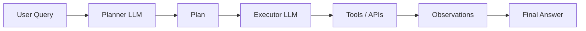

# Plan & Execute Agents

## Overview

Plan & Execute is an agent architecture where the model first creates a **high-level plan** and then executes it step-by-step using tools or sub-agents.

Unlike ReAct (which reasons and acts iteratively), Plan & Execute separates:

- **Planning phase (global strategy)**
- **Execution phase (step-by-step actions)**

This improves reliability for complex multi-step tasks.

---

## Why Plan & Execute is Needed

ReAct agents can:

- overthink
- loop unnecessarily
- make short-term decisions without global structure

Plan & Execute solves this by forcing:

> “Think first, act later.”

This is especially useful when tasks require:
- multiple steps
- dependency ordering
- tool orchestration
- long workflows

---

## Core Idea

```text
Plan → Execute Step 1 → Execute Step 2 → ... → Final Answer
```

---

## High-Level Architecture



---

## Step-by-Step Flow

### Step 1: Planning Phase

The model generates a structured plan:

Example:

```
Task: Find total population of France and compare with Germany

Plan:
1. Get population of France
2. Get population of Germany
3. Compare both values
4. Return difference and ratio
```

---

### Step 2: Execution Phase

Each step is executed sequentially:

#### Step 1:
```
Search population of France → 67M
```

#### Step 2:
```
Search population of Germany → 84M
```

#### Step 3:
```
Compute difference → 17M
Compute ratio → 0.8
```

---

### Step 3: Final Answer

```
Germany has ~17M more people than France.
France population is ~80% of Germany.
```

---

## Variants of Plan & Execute

### 1. Single-Agent Plan & Execute

One model:
- generates plan
- executes steps

Simple but less robust.

---

### 2. Planner–Executor Separation (Common in production)

Two components:

- **Planner** → creates strategy
- **Executor** → runs steps

Benefits:
- modular
- easier debugging
- better scalability

---

### 3. Hierarchical Planning

Breaks tasks into sub-tasks:

```
Level 1: Main plan
Level 2: Sub-plans
Level 3: Tool execution
```

Used in complex systems like coding agents.

---

## Plan & Execute vs ReAct

| ReAct | Plan & Execute |
|------|----------------|
| Reactive | Proactive |
| Step-by-step reasoning | Global planning first |
| Can be chaotic | Structured workflow |
| Good for dynamic tasks | Good for structured tasks |

---

## Plan & Execute vs Reflection

| Reflection | Plan & Execute |
|------------|----------------|
| Improves output quality | Structures task execution |
| Post-processing | Pre-processing |
| Self-critique | Task decomposition |

---

## When to Use Plan & Execute

Use when tasks are:

- multi-step
- deterministic in structure
- tool-heavy workflows
- long-running processes

Examples:
- travel planning
- report generation
- data analysis pipelines
- multi-API orchestration
- coding agents

---

## When NOT to Use

Avoid when:

- tasks are simple
- real-time decisions needed
- latency is critical
- no clear decomposition possible

---

## Production Considerations

### 1. Plan Validation
Ensure plan is:
- complete
- logically ordered
- feasible

---

### 2. Step Tracking
Maintain state:

```
Step → Status → Output
```

---

### 3. Failure Handling
If a step fails:
- retry
- re-plan
- or skip with fallback

---

### 4. Execution Limits
Prevent infinite workflows:
- max steps
- timeout per step

---

### 5. Tool Integration
Each step may call:
- search APIs
- vector DB
- calculators
- external services

---

## Example Use Case

### Travel Planning Agent

**Plan:**
1. Find flights
2. Find hotels
3. Estimate budget
4. Build itinerary

**Execution:**
- calls flight API
- calls hotel API
- aggregates results
- generates itinerary

---

## Why It Works

Plan & Execute improves performance because:

- reduces local decision errors
- enforces global structure
- improves tool coordination
- simplifies debugging
- increases reliability

---

## Limitations

### 1. Plan can be wrong
If initial plan is bad → execution suffers

---

### 2. Less flexible than ReAct
Harder to adapt mid-execution

---

### 3. Latency overhead
Planning step adds extra LLM call

---

## Production Optimizations

- Validate plans before execution
- Allow dynamic replanning
- Cache common plans
- Use lightweight model for planning
- Use stronger model for execution

---

## Interview Answer (30 sec)

> Plan & Execute is an agent architecture where the LLM first generates a high-level plan for solving a task and then executes each step sequentially using tools or APIs. It improves reliability by separating planning from execution, making it suitable for complex multi-step workflows.

---

## Interview Answer (2 min)

Plan & Execute is an agent framework that separates reasoning into two phases: planning and execution. In the planning phase, the model creates a structured sequence of steps required to solve a task. In the execution phase, each step is carried out sequentially, often using tools or external APIs.

This approach reduces errors compared to ReAct by enforcing global structure before action. It is particularly useful for complex workflows such as travel planning, data analysis, or multi-API orchestration. However, it introduces overhead in latency and requires mechanisms for plan validation and failure handling.

---

## Common Follow-up Questions

### How is Plan & Execute different from ReAct?

ReAct is reactive and step-by-step; Plan & Execute is structured and pre-planned.

---

### Can plans change during execution?

Yes, in advanced systems dynamic replanning is supported.

---

### What is the main risk?

Incorrect initial plan leading to cascading failures.

---

### Where is it used in production?

- AI copilots
- workflow automation agents
- enterprise AI assistants
- multi-tool orchestration systems

---

## References

- OpenAI Planning Agents Research
- LangChain Agent Architectures
- “ReAct vs Plan-and-Solve” Papers
