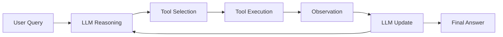

# ReAct (Reason + Act)

## Overview

ReAct (Reason + Act) is an agent framework where an LLM alternates between:

- **Reasoning** (thinking about what to do next)
- **Acting** (using tools like search, APIs, or databases)

Instead of generating a single answer directly, the model performs a loop of reasoning and tool usage until it arrives at the final response.

---

## Why ReAct is Needed

LLMs alone have limitations:

- No real-time information
- No ability to query external systems
- No persistent environment interaction
- Prone to hallucination when uncertain

ReAct solves this by allowing the model to:

- think step-by-step
- use tools dynamically
- refine answers based on observations

---

## Core Idea

ReAct follows this loop:

```text
Thought → Action → Observation → Thought → Action → Observation → Final Answer
```

---

## How ReAct Works



---

## Example

### User Query:
```
What is the population of France divided by 2?
```

---

### Step 1: Thought
```
I need to find the population of France first.
```

---

### Step 2: Action
```
Search[population of France]
```

---

### Step 3: Observation
```
France population ≈ 67 million
```

---

### Step 4: Thought
```
Now divide by 2.
```

---

### Step 5: Action
```
Calculator[67,000,000 / 2]
```

---

### Step 6: Observation
```
33,500,000
```

---

### Final Answer
```
33.5 million
```

---

## Key Components

### 1. Reasoning

The model decides:
- what it knows
- what it needs
- what tool to use next

---

### 2. Actions (Tool Use)

Examples of tools:
- Search engines
- Vector databases
- APIs
- Calculators
- Code execution

---

### 3. Observations

Results returned by tools.

These are fed back into the model.

---

## ReAct vs Traditional LLM

| Traditional LLM | ReAct Agent |
|----------------|-------------|
| Single forward pass | Iterative loop |
| No tool usage | Uses tools dynamically |
| Prone to hallucination | Grounded in observations |
| Static response | Adaptive reasoning |

---

## ReAct Loop in Practice

```text
User Question
     ↓
LLM Reasoning
     ↓
Tool Call (if needed)
     ↓
External System Response
     ↓
LLM Updates Reasoning
     ↓
Repeat until final answer
```

---

## Why ReAct Works

ReAct improves performance because:

- It reduces hallucinations (uses real observations)
- It breaks complex problems into steps
- It allows external knowledge access
- It mimics human problem-solving

---

## ReAct in Production Systems

Used in:

- AI search agents
- Coding assistants
- Data analysis tools
- Customer support bots
- Multi-tool orchestration systems

---

## Limitations

### 1. Latency
Multiple tool calls increase response time.

---

### 2. Cost
Each reasoning step may call an LLM or external API.

---

### 3. Loop Control
Agents may:
- overthink
- loop unnecessarily
- call too many tools

---

### 4. Prompt Sensitivity
Small prompt changes can affect behavior significantly.

---

## Production Optimizations

- Limit max reasoning steps
- Cache tool outputs
- Use structured tool schemas
- Add stopping conditions
- Use cheaper models for intermediate steps

---

## ReAct Prompt Pattern

Typical structure:

```
You are an agent that can:
- Think step by step
- Use tools when needed

Format:
Thought:
Action:
Observation:
Final Answer:
```

---

## Interview Answer (30 sec)

> ReAct is an agent framework where an LLM alternates between reasoning and acting using external tools. It follows a loop of Thought, Action, and Observation, allowing the model to solve complex problems by interacting with external systems instead of relying only on internal knowledge.

---

## Interview Answer (2 min)

ReAct is a framework that enables LLMs to perform iterative reasoning and tool use. Instead of producing a final answer in a single pass, the model goes through cycles of reasoning, deciding whether external information is needed, executing tool calls, and incorporating the results as observations.

This loop continues until the model reaches a final answer. It improves accuracy by grounding responses in real data sources like search engines, APIs, or databases. ReAct is widely used in production AI systems such as agents, coding assistants, and retrieval-based tools because it reduces hallucinations and enables multi-step reasoning.

---

## Common Follow-up Questions

### How is ReAct different from RAG?

RAG retrieves context once; ReAct dynamically decides when and what to retrieve during reasoning.

---

### What tools can ReAct use?

Any external system:
- APIs
- Search engines
- databases
- calculators
- code execution environments

---

### What prevents ReAct from looping forever?

Stopping conditions like:
- max steps
- confidence threshold
- tool limits

---

### Is ReAct deterministic?

No. It is probabilistic and depends on model behavior and prompts.

---

## References

- ReAct: Synergizing Reasoning and Acting in Language Models (Yao et al., 2022)
- LangChain Agents Documentation
- OpenAI Tool Use / Function Calling Docs
