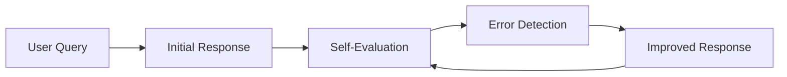

# Reflection

## Overview

Reflection is an agent technique where an LLM evaluates its own outputs, identifies mistakes or gaps, and improves its response through iterative self-review.

Unlike ReAct, which focuses on interacting with external tools, Reflection focuses on **self-critique and self-improvement**.

---

## Why Reflection is Needed

LLMs often:

- produce incorrect reasoning steps
- miss constraints
- hallucinate details
- fail on multi-step tasks

Reflection helps by adding a second layer of thinking:

> “Is my answer correct? If not, how do I fix it?”

---

## Core Idea

Reflection follows a loop:

```text
Initial Answer → Critique → Improved Answer → Repeat (optional)
```

---

## How Reflection Works



---

## Example

### User Query:
```
Explain how quicksort works.
```

---

### Step 1: Initial Answer

```
Quicksort is a sorting algorithm that uses partitioning...
```

---

### Step 2: Reflection (Self-Critique)

```
Check:
- Did I explain partitioning clearly?
- Did I include time complexity?
- Did I give an example?

Issue:
- Missing step-by-step example
```

---

### Step 3: Improved Answer

```
Quicksort works by selecting a pivot, partitioning the array...
Example:
[5,2,8,1] → pivot = 5 → left [2,1], right [8]
```

---

## Types of Reflection

### 1. Self-Refinement

Model improves its own output.

Used for:
- code generation
- explanations
- writing tasks

---

### 2. Self-Critique

Model explicitly identifies errors.

Example:
```
What is wrong with my previous answer?
```

---

### 3. Multi-Step Reflection

Repeated improvement cycles:

```
Answer → Critique → Fix → Critique → Final Answer
```

---

## Reflection vs ReAct

| ReAct | Reflection |
|------|------------|
| Uses external tools | Uses internal reasoning |
| Action + Observation loop | Critique + revision loop |
| Grounded in external data | Grounded in self-evaluation |
| Solves factual tasks | Improves reasoning quality |

---

## When Reflection is Used

- Code generation assistants
- Essay / writing improvement
- Complex reasoning tasks
- Agentic workflows
- Debugging AI outputs

---

## Benefits

- Improves accuracy
- Reduces logical errors
- Enhances reasoning quality
- Produces more structured outputs

---

## Limitations

### 1. Higher latency
Multiple LLM passes required

---

### 2. Cost increase
Each reflection step uses compute

---

### 3. No guarantee of correctness
Model may still miss errors

---

### 4. Over-reflection
Can lead to unnecessary iterations

---

## Production Optimizations

- Limit number of reflection cycles (1–3 max)
- Use smaller model for critique step
- Cache intermediate outputs
- Stop when no improvements detected
- Use structured evaluation rubrics

---

## Reflection Prompt Pattern

Typical structure:

```
Step 1: Generate answer
Step 2: Evaluate answer for correctness, completeness, clarity
Step 3: Improve answer based on feedback
```

---

## Real-World Use Cases

- AI coding assistants (debugging code)
- Writing assistants (improving drafts)
- Research agents (validating reasoning)
- Customer support bots (self-checking responses)

---

## Interview Answer (30 sec)

> Reflection is an agent technique where the LLM evaluates its own output, identifies mistakes or missing information, and improves the response through iterative self-critique and refinement. It is used to enhance reasoning quality and reduce errors in generated outputs.

---

## Interview Answer (2 min)

Reflection is a self-improvement mechanism for LLMs where the model reviews its own output, identifies errors or gaps, and generates an improved version. Unlike ReAct, which relies on external tools and observations, Reflection is entirely internal and focuses on improving reasoning quality.

The process typically involves generating an initial response, evaluating it against correctness and completeness criteria, and then refining it based on identified issues. This can be repeated for multiple iterations until a satisfactory output is produced. Reflection is commonly used in coding assistants, writing tools, and complex reasoning systems to improve accuracy and structure.

---

## Common Follow-up Questions

### How is Reflection different from ReAct?

ReAct uses external tools and observations, while Reflection focuses on self-evaluation and improvement.

---

### Does Reflection guarantee correctness?

No. It improves quality but does not guarantee perfect answers.

---

### How many reflection steps are used in production?

Usually 1–3 iterations to balance quality and latency.

---

### Can Reflection be combined with ReAct?

Yes. Many advanced agents use both:
- ReAct for tool use
- Reflection for output refinement

---

## References

- Reflexion: Language Agents with Verbal Reinforcement Learning
- Self-Refine: Iterative Refinement with LLMs
- LangChain Agent Reflection Patterns
