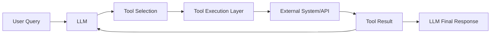

# Tool Calling (Function Calling)

## Overview

Tool calling (also called function calling) is a capability that allows LLMs to interact with external systems by generating structured function calls instead of free-form text.

Instead of only answering questions, the model can:

- call APIs
- query databases
- run calculations
- trigger workflows

---

## Why Tool Calling is Needed

LLMs alone cannot:

- access real-time data
- interact with systems
- guarantee structured outputs
- safely execute operations

Tool calling solves this by making LLM output **machine-structured and executable**.

---

## Core Idea

Instead of:

```
Natural language response
```

The model outputs:

```json
{
  "tool": "search_api",
  "arguments": {
    "query": "population of France"
  }
}
```

Then the system executes the tool and returns the result.

---

## High-Level Architecture



---

## Step-by-Step Flow

### Step 1: User Query

```
What is the weather in San Francisco?
```

---

### Step 2: LLM decides tool

```json
{
  "tool": "weather_api",
  "arguments": {
    "location": "San Francisco"
  }
}
```

---

### Step 3: Tool execution

System calls:

```
weather_api("San Francisco")
```

---

### Step 4: Observation returned

```
San Francisco: 18°C, cloudy
```

---

### Step 5: Final response

```
The current weather in San Francisco is 18°C and cloudy.
```

---

## Tool Calling vs ReAct

| Tool Calling | ReAct |
|-------------|------|
| Structured JSON output | Free-form reasoning |
| Deterministic execution | Flexible reasoning loop |
| Safer in production | More experimental |
| API-driven | Thought-driven |

---

## Tool Schema Design

Tools are defined with strict schemas:

```json
{
  "name": "search_api",
  "description": "Search the web",
  "parameters": {
    "type": "object",
    "properties": {
      "query": { "type": "string" }
    },
    "required": ["query"]
  }
}
```

---

## Types of Tools

### 1. Retrieval Tools
- Vector database search
- Document search
- Knowledge base lookup

---

### 2. External APIs
- Weather API
- Flight API
- Payment APIs
- CRM systems

---

### 3. Computation Tools
- Calculator
- Python runtime
- SQL execution

---

### 4. System Tools
- Email sender
- Notification system
- Ticket creation
- Workflow triggers

---

## Tool Calling vs Prompting

| Prompting | Tool Calling |
|----------|--------------|
| Text output only | Structured function calls |
| No guarantees | Strict schema validation |
| Hard to integrate systems | Native system integration |
| Prone to hallucination | Grounded in real execution |

---

## Why Tool Calling Works Well

- forces structured output
- reduces hallucination
- enables real-world actions
- separates reasoning from execution
- improves reliability

---

## Production Considerations

### 1. Schema Validation
Always validate tool arguments before execution.

---

### 2. Tool Safety Layer
Prevent dangerous actions:
- deleting data
- financial transactions
- unauthorized access

---

### 3. Timeout Handling
Tools must have:
- max execution time
- fallback responses

---

### 4. Tool Selection Limits
Restrict:
- number of tool calls per query
- recursion depth

---

### 5. Logging & Observability
Track:
- tool usage frequency
- failure rates
- latency per tool

---

## Common Failure Modes

### 1. Hallucinated tool arguments
Model generates invalid JSON or wrong parameters.

---

### 2. Wrong tool selection
Model picks incorrect tool for task.

---

### 3. Tool misuse loops
Repeated tool calls without convergence.

---

### 4. Missing fallback paths
System breaks when tool fails.

---

## Production Pattern: Tool Router

Many systems use a **tool router layer**:

```
LLM → Tool Router → Validated Tool Execution
```

This ensures:
- safe execution
- deterministic behavior
- schema compliance

---

## Advanced Pattern: Multi-Tool Use

LLMs can call multiple tools in sequence:

```
Search → Fetch Data → Compute → Format Result
```

This becomes foundation of agent systems.

---

## Tool Calling vs Agents

| Tool Calling | Agents |
|-------------|--------|
| Single step tool use | Multi-step reasoning loop |
| Deterministic | Adaptive |
| Controlled execution | Flexible decision making |

Tool calling is often the **building block** of agents.

---

## Example: SQL Tool

User:
```
What were sales last month?
```

Tool call:

```json
{
  "tool": "sql_query",
  "arguments": {
    "query": "SELECT SUM(sales) FROM orders WHERE month = 'June'"
  }
}
```

---

## Example: RAG Tool

User:
```
What is our refund policy?
```

Tool call:

```json
{
  "tool": "vector_search",
  "arguments": {
    "query": "refund policy"
  }
}
```

---

## Interview Answer (30 sec)

> Tool calling allows LLMs to interact with external systems by generating structured function calls instead of free-form text. The model selects a tool, provides structured arguments, and the system executes the tool and returns results, enabling reliable integration with APIs and databases.

---

## Interview Answer (2 min)

Tool calling is a mechanism where LLMs output structured function calls instead of natural language responses. Each tool is defined with a schema, and the model selects the appropriate tool and provides structured arguments. The system then executes the tool, retrieves the result, and feeds it back into the model for final response generation.

This approach enables LLMs to interact with external systems like APIs, databases, and computation engines in a safe and deterministic way. It reduces hallucinations, improves reliability, and is widely used in production AI systems such as copilots, assistants, and enterprise automation tools.

---

## Common Follow-up Questions

### How is tool calling different from ReAct?

Tool calling is structured and deterministic; ReAct is iterative and reasoning-driven.

---

### What happens if tool arguments are invalid?

They are rejected by schema validation and retried or corrected.

---

### Can LLM call multiple tools?

Yes, but usually controlled via orchestration or agent frameworks.

---

### Why is tool calling important in production?

Because it enables safe, structured interaction with real-world systems.

---

## References

- OpenAI Function Calling Documentation
- LangChain Tools and Agents
- ReAct + Tool Use Research Papers
- Toolformer (Meta AI)
