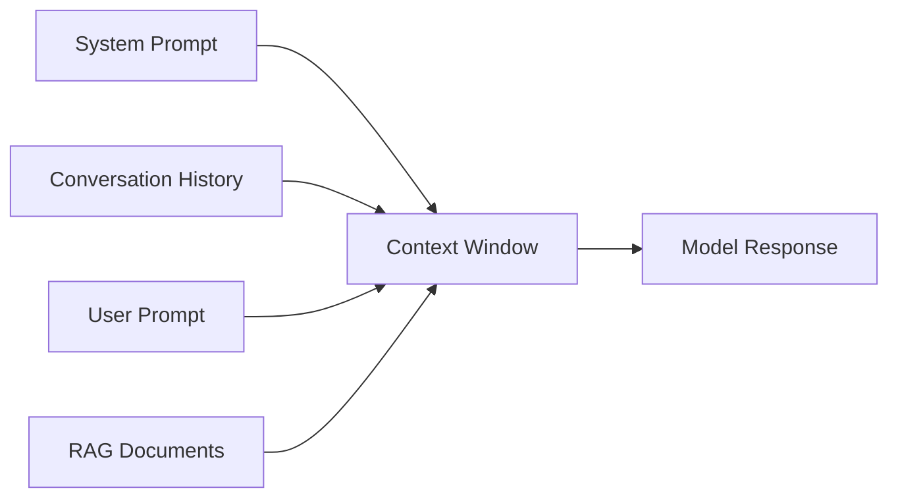
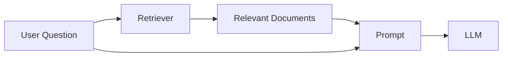

# Context Window

## Overview

A context window is the maximum amount of information (measured in **tokens**) that a Large Language Model (LLM) can process at one time.

It includes everything the model sees during inference:

- System prompt
- User prompt
- Conversation history
- Retrieved documents (for RAG)
- Previously generated tokens

If the total number of tokens exceeds the model's context window, some information must be removed or truncated.

---

## Why is a Context Window Needed?

Transformers use self-attention, where every token attends to every other token in the sequence.

As the number of tokens increases:

- Memory usage increases
- Computation becomes more expensive
- Inference becomes slower

To keep computation manageable, every model has a maximum context window.

---

## How It Works



Everything inside the box counts toward the context window.

---

## Example

Suppose a model supports **8,000 tokens**.

Your request contains:

| Component | Tokens |
|----------|--------:|
| System Prompt | 500 |
| Chat History | 2,000 |
| Retrieved Documents | 4,000 |
| User Question | 300 |

Total input:

```
6,800 tokens
```

The model still has approximately **1,200 tokens** available for generating a response.

---

## What Happens If the Limit Is Exceeded?

If the total exceeds the context window, different applications may:

- Truncate older conversation history
- Retrieve fewer documents
- Shorten prompts
- Reject the request with an error

Example:

```
Context Window: 8,000 tokens

Input:
9,500 tokens

↓

Too large

↓

Application removes older messages
```

---

## Context Window vs Memory

A context window is **not** long-term memory.

The model only knows what is included in the current prompt.

Once the request finishes, that context is gone unless the application stores it and sends it again in future requests.

---

## Why Context Windows Matter

Larger context windows enable:

- Longer conversations
- Larger documents
- More retrieved context in RAG
- Better code understanding
- Analysis of long reports

However, larger context windows also increase compute and memory requirements.

---

## Context Window in RAG

RAG retrieves relevant documents and adds them to the prompt.



The retrieved documents consume part of the available context window.

If too many documents are retrieved, there may be little room left for the model's response.

---

## Production Considerations

When building AI applications:

- Keep prompts concise.
- Retrieve only the most relevant documents.
- Reserve enough tokens for the model's response.
- Monitor prompt size to avoid exceeding limits.

For chat applications:

- Summarize older conversation history.
- Remove irrelevant messages.
- Use retrieval instead of sending the entire conversation.

---

## Python Example

Using the `tiktoken` library to estimate token count:

```python
import tiktoken

encoding = tiktoken.encoding_for_model("gpt-4")

text = "Explain how context windows work."

tokens = encoding.encode(text)

print(len(tokens))
```

---

## Interview Answer (30 sec)

> A context window is the maximum number of tokens an LLM can process in a single request. It includes the system prompt, user input, conversation history, retrieved documents, and generated tokens. If the limit is exceeded, the application must truncate or summarize content before sending it to the model.

---

## Interview Answer (2 min)

The context window defines how much information an LLM can consider during inference. Since Transformers use self-attention, computation grows significantly as the sequence length increases, making unlimited context impractical.

Everything included in a request counts toward the context window, including prompts, chat history, retrieved documents, and previously generated tokens. In production systems, developers manage this limitation by summarizing older conversations, retrieving only the most relevant documents in RAG, and budgeting tokens to leave space for the model's response.

Understanding context windows is important because they directly affect latency, cost, retrieval quality, and user experience.

---

## Common Follow-up Questions

### Does a larger context window make the model smarter?

No.

A larger context window allows the model to consider more information, but it does not increase the model's reasoning ability or knowledge.

---

### Why are context windows measured in tokens instead of words?

Because LLMs process tokens, not words. Different words and languages may produce different numbers of tokens.

---

### Why can't we have unlimited context windows?

Self-attention requires comparing tokens with one another, making computation and memory usage increase rapidly as the sequence grows.

---

### How do applications support long conversations?

They typically:

- Summarize older messages
- Remove irrelevant context
- Retrieve information from external storage using RAG
- Send only the information needed for the current request

---

## References

- Attention Is All You Need (2017)
- OpenAI Tokenizer Documentation
- Anthropic Context Window Documentation
