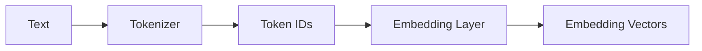
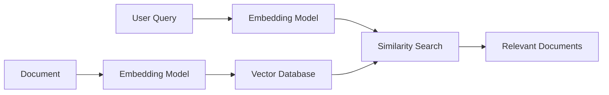

# Embeddings

## Overview

Embeddings are numerical vector representations of data (such as text, images, or audio) that capture their semantic meaning. Instead of representing words as IDs or one-hot vectors, embeddings place similar concepts close together in a high-dimensional vector space.

For example:

- "dog" and "puppy" have similar embeddings.
- "king" and "queen" are closer to each other than "king" and "banana".

Embeddings are the foundation of semantic search, Retrieval-Augmented Generation (RAG), recommendation systems, and modern language models.

---

## Why Do We Need Embeddings?

Computers cannot understand text directly—they work with numbers.

A simple approach is to assign each word an ID:

```text
Dog    → 101
Cat    → 205
Apple  → 999
```

However, these IDs have no meaning. The model cannot infer that "dog" and "cat" are related.

Embeddings solve this by mapping each token or piece of text to a dense vector where similar meanings are located close together.

---

## How Embeddings Work

The process looks like this:



Example:

```text
Input:
"I love AI"

↓

Token IDs:
[40, 1842, 15592]

↓

Embedding Vectors:
[
 [0.21, -0.45, ...],
 [1.03,  0.81, ...],
 [-0.12, 0.67, ...]
]
```

Each token becomes a vector with hundreds or thousands of dimensions.

---

## What Does "Semantic Meaning" Mean?

Embeddings capture meaning rather than exact words.

Example:

```text
Dog
Puppy
Golden Retriever
```

These vectors will be close together.

Similarly:

```text
Car
Vehicle
Truck
```

will form another cluster.

This allows models to find related content even when the exact words are different.

---

## Measuring Similarity

The most common way to compare embeddings is **cosine similarity**.

Cosine similarity measures the angle between two vectors.

- **1** → Identical direction (very similar)
- **0** → Unrelated
- **-1** → Opposite direction

Example:

```text
Embedding("dog")
Embedding("puppy")

↓

Cosine Similarity = 0.95
```

Whereas:

```text
Embedding("dog")
Embedding("airplane")

↓

Cosine Similarity = 0.12
```

---

## Types of Embeddings

### Token Embeddings

Used inside LLMs.

Each token is converted into a vector before entering the Transformer.

---

### Sentence Embeddings

Represent an entire sentence as a single vector.

Example:

```text
"How do I reset my password?"
```

Useful for semantic search and question answering.

---

### Document Embeddings

Represent a paragraph or document.

Used in:

- RAG
- Search
- Recommendation systems

---

## Embeddings in RAG

Embeddings are the core of Retrieval-Augmented Generation.

Workflow:



Instead of searching for exact keywords, RAG searches for documents with similar embeddings.

---

## Example

Document:

> "Dogs are loyal pets."

User asks:

> "Tell me about puppies."

Even though the word "puppies" is not in the document, the embeddings are similar enough that the document may still be retrieved.

---

## Python Example

Using the `sentence-transformers` library:

```python
from sentence_transformers import SentenceTransformer

model = SentenceTransformer("all-MiniLM-L6-v2")

embedding = model.encode("AI Engineering Handbook")

print(embedding.shape)
```

Output:

```text
(384,)
```

This means the sentence is represented as a 384-dimensional vector.

---

## Production Considerations

- Use the **same embedding model** for both indexing documents and embedding user queries.
- If you change the embedding model, you'll usually need to regenerate document embeddings.
- Higher-dimensional embeddings may improve quality but require more storage and computation.
- Monitor retrieval quality when changing embedding models.

---

## Interview Answer (30 sec)

> Embeddings are dense vector representations of data that capture semantic meaning. Similar concepts are mapped close together in vector space, enabling semantic search, RAG, recommendation systems, and language understanding. LLMs use token embeddings as input to the Transformer, while RAG systems use sentence or document embeddings for retrieval.

---

## Interview Answer (2 min)

Embeddings convert text into dense numerical vectors that preserve semantic relationships. Unlike one-hot encoding or token IDs, embeddings place related concepts close together in vector space, allowing models to measure similarity using metrics like cosine similarity.

Inside an LLM, token embeddings are the first learned representation before positional information is added and passed into the Transformer. In RAG systems, entire sentences or documents are embedded and stored in a vector database. At query time, the user's question is embedded using the same model, and similarity search retrieves the most relevant documents for the LLM.

---

## Common Follow-up Questions

### Why are embeddings better than one-hot encoding?

One-hot vectors do not capture relationships between words, while embeddings encode semantic similarity.

---

### Why is cosine similarity commonly used?

Because it compares the direction of vectors rather than their magnitude, making it effective for measuring semantic similarity.

---

### Why should the same embedding model be used for documents and queries?

Using different models can place vectors in different embedding spaces, reducing retrieval accuracy.

---

### Do LLMs and RAG use the same embeddings?

Not necessarily.

LLMs use token embeddings internally, while RAG systems often use specialized embedding models optimized for semantic retrieval.

---

## References

- Attention Is All You Need (2017)
- Sentence-BERT (SBERT)
- OpenAI Embeddings Documentation
- Hugging Face Sentence Transformers Documentation
