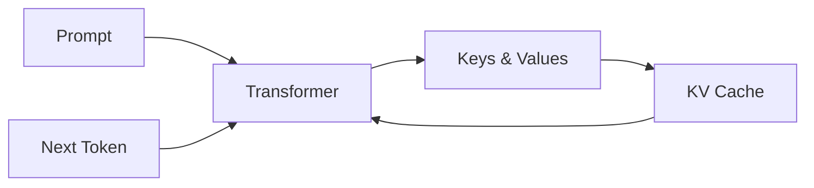

# KV Cache

## Overview

KV (Key-Value) Cache is an optimization used during LLM inference to avoid recomputing attention for previously processed tokens.

Instead of recalculating the Key (K) and Value (V) vectors for the entire input sequence every time a new token is generated, the model stores them in memory and reuses them.

This significantly reduces inference latency and improves throughput.

---

## Why is KV Cache Needed?

LLMs generate text **one token at a time**.

Without KV Cache, every new token would require recomputing attention for all previous tokens.

Example:

```
Prompt:

"I love AI"

↓

Generate:
"because"

Without KV Cache:

"I"
"I love"
"I love AI"
"I love AI because"

Each step recomputes attention for all previous tokens.
```

As sequences grow longer, this becomes increasingly expensive.

---

## How KV Cache Works

During inference:

1. Process the initial prompt.
2. Compute the Key and Value vectors for each token.
3. Store these vectors in memory.
4. When generating the next token:
   - Compute Key and Value only for the new token.
   - Reuse cached Key and Value vectors for all previous tokens.
   - Compute attention using both cached and new vectors.

This avoids redundant computation.

---

## Architecture



The Transformer reuses the cached Keys and Values while processing new tokens.

---

## Example

Prompt:

```
AI is transforming software engineering
```

Without KV Cache:

```
Token 1 → Compute attention

Token 2 → Recompute Tokens 1–2

Token 3 → Recompute Tokens 1–3

Token 4 → Recompute Tokens 1–4
```

With KV Cache:

```
Token 1 → Compute and cache

Token 2 → Reuse Token 1 cache

Token 3 → Reuse Tokens 1–2 cache

Token 4 → Reuse Tokens 1–3 cache
```

Only the new token requires fresh computation.

---

## What is Cached?

Only the **Key** and **Value** vectors are cached.

The **Query** vector is computed for the newly generated token because it depends on the current token.

---

## Benefits

- Lower inference latency
- Higher throughput
- Reduced computation
- Faster streaming responses
- Better GPU utilization

KV Cache is one of the main reasons modern LLMs can generate responses interactively.

---

## Trade-offs

Advantages:

- Faster generation
- Lower compute cost
- Better user experience

Disadvantages:

- Increased GPU memory usage
- Cache grows with sequence length
- Limits maximum concurrent requests on fixed hardware

Applications must balance latency and memory consumption.

---

## KV Cache and Context Window

The KV Cache grows as more tokens are processed.

Longer context windows require larger caches, increasing memory usage.

For very long conversations, applications may:

- Limit context length
- Summarize older messages
- Clear the cache between requests

---

## Production Considerations

Most production inference frameworks use KV Cache by default.

Common optimizations include:

- Cache compression
- Paged KV Cache
- Continuous batching
- Efficient GPU memory management

These techniques improve throughput for high-traffic AI applications.

---

## Interview Answer (30 sec)

> KV Cache is an inference optimization that stores the Key and Value vectors computed for previous tokens. During text generation, the model reuses these cached vectors instead of recomputing them, significantly reducing latency and computation. Only the Query vector for the new token needs to be computed.

---

## Interview Answer (2 min)

During autoregressive generation, an LLM predicts one token at a time. Without KV Cache, each new token would require recomputing attention for every previous token, leading to unnecessary computation and increasing latency as the sequence grows.

KV Cache solves this by storing the Key and Value vectors for all processed tokens in memory. When a new token is generated, the model computes its Query, Key, and Value vectors, reuses the cached Keys and Values from earlier tokens, and computes attention over both the cached and new vectors. This makes generation much faster, although it increases memory usage because the cache grows with the context length.

---

## Common Follow-up Questions

### Why aren't Queries cached?

Queries depend on the current token being generated, so they must be computed for each new token.

---

### Does KV Cache help during training?

No.

KV Cache is primarily used during inference. During training, the model processes complete sequences in parallel.

---

### Why does KV Cache increase memory usage?

Because it stores Key and Value vectors for every processed token across every Transformer layer.

---

### Is KV Cache shared across different user requests?

No.

Each request maintains its own KV Cache because every prompt and conversation is different.

---

### What happens when the context becomes very long?

The KV Cache grows larger, consuming more GPU memory and potentially reducing the number of requests that can be served concurrently.

---

## References

- Attention Is All You Need (2017)
- Hugging Face – KV Cache Documentation
- vLLM Documentation
- TensorRT-LLM Documentation
