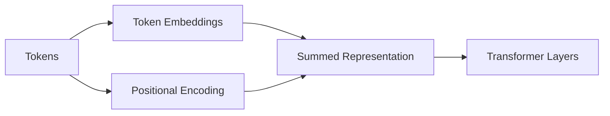

# Positional Encoding

## Overview

Positional encoding is the mechanism that gives Transformers information about the **order of tokens in a sequence**.

Since Transformers process all tokens in parallel (unlike RNNs), they have no built-in sense of order. Positional encoding injects sequence information so the model can distinguish:

- "Dog bites man"
- "Man bites dog"

---

## Why Positional Encoding is Needed

Unlike RNNs:

- Transformers do not process tokens sequentially
- Attention treats input as a set, not a sequence

Without positional encoding:

> "I love AI"  
> "AI love I"

would look identical to the model.

So we need to inject **position awareness**.

---

## High-Level Idea

We add positional information directly to token embeddings:

```text
Final Input Embedding = Token Embedding + Positional Encoding
```

---

## Architecture Flow



---

## Two Main Types of Positional Encoding

### 1. Sinusoidal Positional Encoding (Original Transformer)

Uses sine and cosine functions:

```text
PE(pos, 2i)   = sin(pos / 10000^(2i/d))
PE(pos, 2i+1) = cos(pos / 10000^(2i/d))
```

### Key properties:

- Deterministic (no learning required)
- Works for arbitrary sequence lengths
- Encodes relative position information

---

### 2. Learned Positional Embeddings

Instead of fixed formulas:

- Each position has a learned vector
- Optimized during training

Used in many modern models.

---

## Intuition Behind Sinusoidal Encoding

Different frequencies represent different scales:

- Low frequencies → capture long-range structure
- High frequencies → capture fine-grained order

This allows the model to generalize to unseen sequence lengths.

---

## Simple Visualization

Imagine each position is a unique “wave signature”:

```text
Position 0 → wave pattern A
Position 1 → wave pattern B
Position 2 → wave pattern C
```

Even if token embeddings are similar, position changes the final representation.

---

## Where It is Applied

Positional encoding is added:

- Before the first Transformer layer
- To token embeddings
- At every input sequence

---

## Variants Used in Modern LLMs

### 1. Absolute Positional Encoding
- Each position has a fixed representation
- Used in original Transformer

---

### 2. Learned Positional Embeddings
- Position vectors are trainable
- Used in BERT-style models

---

### 3. RoPE (Rotary Positional Embeddings) ⭐ (Modern LLMs)

Used in:
- LLaMA
- GPT-style models (many variants)
- Qwen

Key idea:
- Encodes relative position via rotation in embedding space

Benefits:
- Better extrapolation to long contexts
- Strong performance in LLMs

---

### 4. ALiBi (Attention with Linear Biases)

- Adds bias to attention scores based on distance
- No explicit positional vectors needed

---

## Why Modern Models Prefer RoPE

RoPE improves:

- Long-context generalization
- Attention stability
- Relative position modeling

It is now widely used in production LLMs.

---

## Python Example (Sinusoidal Encoding)

```python
import torch
import math

def positional_encoding(seq_len, d_model):
    pe = torch.zeros(seq_len, d_model)

    for pos in range(seq_len):
        for i in range(0, d_model, 2):
            pe[pos, i] = math.sin(pos / (10000 ** (i / d_model)))
            pe[pos, i + 1] = math.cos(pos / (10000 ** (i / d_model)))

    return pe
```

---

## How It Fits in Transformer

```text
Token → Embedding → + Positional Encoding → Transformer
```

Without this step, attention has no sense of order.

---

## Production Perspective

### Why it matters:

- Enables sequence understanding
- Impacts long-context performance
- Affects model generalization

### Engineering considerations:

- RoPE scaling for long context models
- Position interpolation for extended sequences
- Memory-efficient implementations in inference engines

---

## Limitations

### Absolute positional encoding:

- Poor generalization to longer sequences

### Learned embeddings:

- Fixed max sequence length

### Sinusoidal:

- Less expressive than modern alternatives

---

## Interview Answer (30 sec)

> "Positional encoding is used in Transformers to inject information about token order since self-attention alone is permutation-invariant. It adds positional vectors to token embeddings so the model can understand sequence structure. Common types include sinusoidal encodings, learned embeddings, and modern approaches like RoPE."

---

## Interview Answer (2 min)

Transformers process all tokens in parallel, so they lack inherent awareness of token order. Positional encoding solves this by adding position-dependent vectors to token embeddings before they enter the model.

The original Transformer used sinusoidal functions to encode positions using sine and cosine at different frequencies, allowing the model to capture both local and global structure. Later models use learned positional embeddings or more advanced techniques like RoPE and ALiBi, which better support long-context generalization.

This mechanism is essential because without it, the model would treat different permutations of the same tokens as identical inputs.

---

## Common Follow-up Questions

### 1. Why not rely on self-attention for order?

Because self-attention is permutation-invariant—it does not encode sequence order.

---

### 2. What is the difference between absolute and relative position encoding?

- Absolute: fixed position index
- Relative: models distance between tokens

---

### 3. Why is RoPE better for LLMs?

Because it encodes relative positions and generalizes better to long contexts.

---

### 4. Does positional encoding affect inference speed?

Minimal direct impact, but it influences model architecture and memory patterns.

---

## Production Insight

In real LLM systems:

- RoPE scaling is critical for long-context models (8K → 128K tokens)
- Position extrapolation is a major research area
- Attention behavior changes significantly with position encoding choice

---

## Next Topic

👉 Tokenization  
👉 Embeddings  
👉 KV Cache
