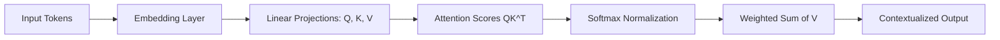

# Self-Attention

## Overview

Self-attention is the core mechanism behind Transformers that allows each token in a sequence to dynamically focus on other tokens to compute a contextual representation.

It is what enables Large Language Models (LLMs) to understand relationships between words, even across long distances.

---

## Why Self-Attention Exists

Before self-attention:

- RNNs processed tokens sequentially
- Long-range dependencies were hard to capture
- Context was compressed into a fixed hidden state

Self-attention solves this by:

- Allowing every token to "see" every other token
- Computing relationships dynamically
- Preserving full context at each layer

---

## Intuition

Consider the sentence:

> "The cat sat on the mat because it was soft."

The model must understand:

- What does "it" refer to?

Self-attention allows:

- "it" → attends strongly to "mat"
- Weak attention to unrelated tokens like "cat"

---

## High-Level Idea

Each token computes three vectors:

- Query (Q): What am I looking for?
- Key (K): What do I contain?
- Value (V): What information do I provide?

---

## Attention Mechanism

The attention score is computed as:

```text
Attention(Q, K, V) = softmax(QKᵀ / √d) V
```

### Step-by-step:

1. Compute similarity between Query and Key
2. Normalize scores using softmax
3. Use scores to weight Value vectors
4. Aggregate weighted values

---

## Architecture Flow



---

## Step-by-Step Example

Sentence:

> "AI engineers build systems"

For token "engineers":

- Q compares against all tokens
- Finds high similarity with "AI" and "build"
- Assigns higher weights to them
- Produces context-aware embedding

---

## Multi-Head Attention

Instead of a single attention operation, Transformers use multiple heads.

Each head learns different relationships:

| Head | Focus |
|------|------|
| Head 1 | Syntax (grammar) |
| Head 2 | Semantic meaning |
| Head 3 | Long-range dependencies |
| Head 4 | Positional patterns |

Outputs are concatenated and projected.

---

## Why Scale by √d?

Without scaling:

- Dot products grow large
- Softmax becomes saturated
- Gradients become unstable

Scaling stabilizes training:

```text
QKᵀ / √d
```

---

## Masked Self-Attention (Important for LLMs)

In decoder-only models (like GPT):

- Tokens cannot see future tokens
- A triangular mask is applied

Example:

```text
"I   love   AI"
 ↑    ↑     ↑
only sees past tokens
```

This ensures autoregressive generation.

---

## Python Example (Simplified)

```python
import torch
import torch.nn.functional as F

def self_attention(Q, K, V):
    d_k = Q.size(-1)

    scores = torch.matmul(Q, K.transpose(-2, -1))
    scores = scores / (d_k ** 0.5)

    weights = F.softmax(scores, dim=-1)

    output = torch.matmul(weights, V)
    return output
```

---

## Production Perspective

In real LLM systems:

### Optimizations used:

- KV Cache (avoid recomputing attention)
- FlashAttention (memory-efficient computation)
- Tensor parallelism (multi-GPU scaling)
- Mixed precision (FP16 / BF16)

### Challenges:

- O(n²) memory complexity
- Expensive for long contexts
- Latency increases with sequence length

---

## Why Self-Attention Works So Well

- Dynamically models relationships
- No fixed window like CNNs or RNNs
- Learns context at multiple levels
- Scales effectively with data

---

## Limitations

- Quadratic complexity (O(n²))
- High memory usage
- Expensive for long sequences
- Requires optimization for production use

---

## Interview Answer (30 sec)

> "Self-attention is a mechanism in Transformers where each token attends to every other token in the input sequence to build contextual representations. It uses Query, Key, and Value vectors to compute attention scores, allowing the model to focus on relevant tokens and capture long-range dependencies."

---

## Interview Answer (2 min)

Self-attention works by projecting each token into Query, Key, and Value vectors. The similarity between Query and Key vectors determines how much attention each token pays to others. These scores are normalized using softmax and used to compute a weighted sum of Value vectors.

This allows each token to dynamically incorporate information from the entire sequence, making it highly effective for modeling context and long-range dependencies. It is the core mechanism behind Transformers and modern LLMs.

---

## Common Follow-up Questions

### 1. Why do we need multiple attention heads?

To learn different types of relationships in parallel, such as syntax, semantics, and positional structure.

---

### 2. What is the difference between self-attention and cross-attention?

- Self-attention: tokens attend to tokens in the same sequence
- Cross-attention: tokens attend to another sequence (used in encoder-decoder models)

---

### 3. Why is attention O(n²)?

Because each token computes similarity with every other token in the sequence.

---

### 4. What is the role of softmax?

It converts raw attention scores into probabilities that sum to 1.

---

## Production Insight

In large-scale systems:

- Self-attention is often the main bottleneck
- KV cache is critical for reducing inference cost
- Long-context models require optimized attention kernels

---

## Next Topic

👉 Positional Encoding  
👉 Multi-Head Attention  
👉 KV Cache
