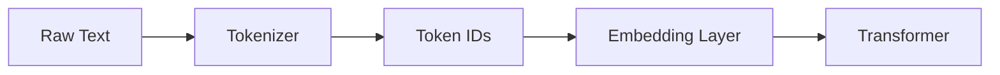

# Tokenization

## Overview

Tokenization is the process of converting raw text into smaller units called **tokens** that a language model can process.

A token is not necessarily a word. Depending on the tokenizer, a token may represent:

- A whole word
- Part of a word (subword)
- A single character
- Punctuation
- Whitespace
- Emojis or special symbols

Since LLMs operate on tokens rather than raw text, tokenization is the first step in both training and inference.

---

## Why Tokenization is Needed

Neural networks work with numbers, not text.

Before a model can understand language, text must be transformed into a sequence of token IDs.

Example:

```text
Input:
I love AI!

↓

Tokens:
["I", " love", " AI", "!"]

↓

Token IDs:
[40, 1842, 15592, 0]
```

These token IDs are then converted into embeddings before entering the Transformer.

---

## Where Tokenization Fits



---

## Example

Sentence:

```text
Artificial Intelligence is amazing!
```

Possible tokenization:

```text
["Artificial", " Intelligence", " is", " amazing", "!"]
```

A different tokenizer might split it as:

```text
["Art", "ificial", " Intelligence", " is", " amaz", "ing", "!"]
```

Both are valid.

---

## Common Tokenization Algorithms

### Word-based Tokenization

Splits text into words.

Example:

```text
"I love AI"

↓

["I", "love", "AI"]
```

Pros:

- Easy to understand

Cons:

- Huge vocabulary
- Cannot handle unseen words

---

### Character Tokenization

Splits every character.

```text
"I love"

↓

["I"," ","l","o","v","e"]
```

Pros:

- Handles every possible input

Cons:

- Very long sequences
- Inefficient

---

### Subword Tokenization ⭐

Most modern LLMs use subword tokenization.

Example:

```text
Unbelievable

↓

["Un", "believ", "able"]
```

Advantages:

- Smaller vocabulary
- Handles unknown words
- Efficient representation

---

## Popular Tokenizers

### Byte Pair Encoding (BPE)

Used by:

- GPT-2
- GPT-3

Idea:

- Merge frequently occurring character pairs
- Builds vocabulary incrementally

---

### WordPiece

Used by:

- BERT

Idea:

- Selects subwords that maximize language modeling likelihood

---

### SentencePiece

Used by:

- T5
- ALBERT

Features:

- Language-independent
- Doesn't require whitespace
- Good for multilingual models

---

### Byte-level BPE

Used by many GPT-family models.

Advantages:

- Represents every possible Unicode character
- Handles emojis and uncommon symbols
- Avoids unknown tokens

---

## Why Tokenization Matters

Tokenization directly affects:

- Context window usage
- Inference cost
- Training efficiency
- Retrieval quality in RAG
- Prompt length

Example:

Two prompts with the same number of words can produce very different token counts.

---

## Token Count Example

```text
Hello!

↓

2 tokens
```

```text
Supercalifragilisticexpialidocious

↓

May become multiple tokens
```

Long or uncommon words often split into multiple tokens.

---

## Tokens vs Words

They are **not** the same.

Example:

```text
The quick brown fox.
```

Words:

```
4
```

Tokens:

```
5 or 6
```

depending on the tokenizer.

---

## Special Tokens

LLMs use special-purpose tokens.

Examples:

| Token | Purpose |
|--------|---------|
| `<BOS>` | Beginning of sequence |
| `<EOS>` | End of sequence |
| `<PAD>` | Padding |
| `<UNK>` | Unknown token (rare in byte-level tokenizers) |

These help the model understand sequence boundaries and batching.

---

## Production Perspective

### Why engineers care

Tokenization affects:

- API cost (billing is usually per token)
- Latency
- Maximum context length
- Memory usage

Example:

A prompt that doubles in token count typically requires more compute and memory.

---

### RAG Considerations

Chunking strategies should be based on **token count**, not character count.

Instead of:

```text
1000 characters
```

prefer:

```text
512 tokens
```

because context limits are measured in tokens.

---

### Prompt Engineering

When optimizing prompts:

- Remove unnecessary verbosity
- Reuse system prompts where possible
- Monitor token usage to reduce cost

---

## Python Example

Using the Hugging Face `transformers` library:

```python
from transformers import AutoTokenizer

tokenizer = AutoTokenizer.from_pretrained("bert-base-uncased")

text = "AI Engineering Handbook"

tokens = tokenizer.tokenize(text)
token_ids = tokenizer.encode(text)

print(tokens)
print(token_ids)
```

---

## Interview Answer (30 sec)

> Tokenization is the process of converting text into tokens that an LLM can process. Modern models typically use subword tokenization, such as Byte Pair Encoding (BPE), to balance vocabulary size and the ability to represent unseen words. Tokenization directly impacts context length, inference cost, and model performance.

---

## Interview Answer (2 min)

LLMs operate on tokens rather than raw text. A tokenizer converts input text into token IDs, which are then mapped to embeddings before entering the Transformer.

Modern models commonly use subword tokenization because it provides a good balance between vocabulary size and flexibility. Instead of treating every word as unique, subword tokenizers split uncommon words into meaningful pieces, allowing the model to generalize to new vocabulary while keeping the vocabulary manageable.

In production systems, tokenization is important because token count determines context window usage, API cost, latency, and memory consumption. For RAG systems, chunking documents by tokens rather than characters leads to more reliable retrieval and generation.

---

## Common Follow-up Questions

### Why don't LLMs tokenize by words?

Because word-level vocabularies become extremely large and cannot represent unseen words efficiently.

---

### Why is subword tokenization preferred?

It balances vocabulary size, generalization, and efficiency while handling rare or new words gracefully.

---

### Why do different models produce different token counts?

Each model may use a different tokenizer and vocabulary, so the same text can be split differently.

---

### Why should RAG chunk by tokens instead of characters?

Because LLM context limits are measured in tokens, and token-based chunking produces more predictable prompt sizes.

---

## Production Insight

When building production AI systems:

- Always estimate token counts before sending prompts to an LLM.
- Budget tokens for both the prompt and the model's response.
- Version your tokenizer alongside your model, since changing tokenizers can affect embeddings, retrieval quality, and application behavior.

---

## Further Reading

- Attention Is All You Need (2017)
- GPT-2: Language Models are Unsupervised Multitask Learners
- SentencePiece: A Simple and Language Independent Subword Tokenizer
