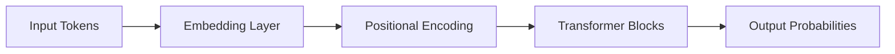

# Transformer Architecture

## Overview

The Transformer is the foundational architecture behind modern Large Language Models (LLMs) such as GPT, Llama, and Claude. It replaces recurrence-based models with **self-attention**, enabling parallel processing of sequences and improved long-range dependency modeling.

---

## Why Transformers Exist

Before Transformers:

- RNNs processed tokens sequentially
- LSTMs struggled with long dependencies
- Training was slow and not parallelizable

Transformers solve this by:

- Processing all tokens in parallel
- Using attention instead of recurrence
- Scaling efficiently to billions of parameters

---

## High-Level Architecture



---

## Key Idea: Self-Attention

Each token looks at every other token and decides:

> “Which words in this sentence are important to me?”

Example:

> "The cat sat on the mat because it was soft"

The model learns that **“it” refers to “mat”**, not “cat”.

---

## How Self-Attention Works

Each token is transformed into:

- Query (Q)
- Key (K)
- Value (V)

Attention score:

```
Attention(Q, K, V) = softmax(QKᵀ / √d) V
```

This allows the model to:

- Focus on relevant tokens
- Ignore irrelevant tokens
- Capture relationships across long distances

---

## Transformer Block

Each block contains:

- Multi-head self-attention
- Feed-forward neural network
- Residual connections
- Layer normalization

Stacking multiple blocks increases reasoning power.

---

## Python Example (Conceptual)

```python
import torch
import torch.nn.functional as F

def attention(Q, K, V):
    scores = Q @ K.transpose(-2, -1)
    scores = scores / (Q.size(-1) ** 0.5)
    weights = F.softmax(scores, dim=-1)
    return weights @ V
```

---

## Production Perspective

In real LLM systems:

- Transformers are stacked into 12–100+ layers
- Models use billions of parameters
- KV cache is used to speed up inference
- Quantization is used for deployment efficiency

---

## Advantages

- Parallel computation
- Better long-range understanding
- Scales to very large models
- Foundation of modern LLMs

---

## Limitations

- High memory usage
- Quadratic attention complexity (O(n²))
- Expensive training and inference

---

## Interview Answer (30 sec)

> "A Transformer is a neural network architecture that uses self-attention to process sequences in parallel. Each token attends to all other tokens to learn contextual relationships. It replaces sequential processing in RNNs and is the foundation of modern LLMs like GPT and Llama."

---

## Interview Answer (2 min)

A Transformer uses self-attention to compute relationships between all tokens in a sequence. Each token is projected into Query, Key, and Value vectors. Attention scores determine how much each token should focus on others. This enables capturing long-range dependencies while allowing parallel computation.

The architecture consists of stacked transformer blocks with multi-head attention, feed-forward layers, residual connections, and normalization. This design allows scaling to billions of parameters, making it the backbone of modern LLMs.

---

## Common Follow-up Questions

### Why is self-attention better than RNNs?

Because it enables parallel processing and better long-range dependency modeling.

---

### What is multi-head attention?

It allows the model to learn different relationships in parallel subspaces.

---

### Why is attention O(n²)?

Because each token attends to every other token in the sequence.

---

## Next Topic

👉 Self-Attention
👉 Embeddings
👉 Tokenization
