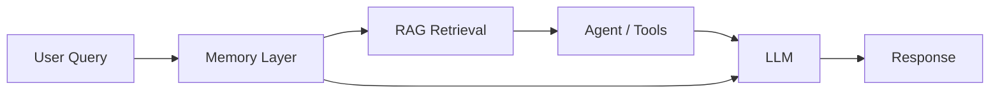

# Memory in LLM Systems

## Overview

Memory in LLM applications refers to mechanisms that allow models to store, retrieve, and use information across interactions.

It enables:
- personalization
- continuity across sessions
- adaptive behavior
- context retention beyond context window limits

---

## Why Memory is Needed

LLMs are stateless by default:

- They do not remember past conversations
- They are limited by context window size
- They cannot persist user preferences

Memory solves these limitations by externalizing state.

---

## Where Memory Fits in AI Systems

Memory influences both:
- input context
- decision making
- tool usage

---

## Types of Memory

1. Short-term Memory (session-based)
2. Long-term Memory (persistent user data)
3. Vector Memory (embedding-based recall)
4. Episodic Memory (event history)

Each serves a different role in production systems.

---

## Memory vs RAG

| Memory | RAG |
|--------|-----|
| User-specific data | Knowledge base data |
| Persistent state | External documents |
| Personalization | Information retrieval |

---

## Production Use Cases

- Chat assistants (ChatGPT-style systems)
- Personal AI copilots
- Customer support agents
- Coding assistants
- Enterprise knowledge systems

---

## Key Design Challenges

- What to store
- When to retrieve memory
- How to prevent stale information
- Privacy and security constraints
- Memory relevance filtering

---

## Summary

Memory transforms LLMs from stateless models into **stateful intelligent systems** capable of personalization and continuity.