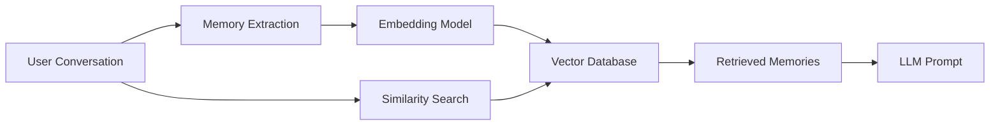

# Vector Memory in LLM Systems

## Overview

Vector memory is a long-term memory approach where information is converted into embeddings and stored in a vector database.

Instead of retrieving memories using exact keyword matching, vector memory retrieves information based on semantic similarity.

Example:

Stored memory:

```
User prefers concise technical explanations.
```

New query:

```
Explain this briefly.
```

The system can retrieve the memory because the meanings are related.

---

# Why Use Vector Memory?

Traditional databases search by exact values:

Example:

```
WHERE preference = "short answers"
```

Vector memory searches by meaning.

Example:

```
"Keep explanations brief"

matches:

"I prefer concise responses"
```

Benefits:

- Semantic search
- Handles natural language variation
- Works well with unstructured data
- Scales to large memory stores

---

# Vector Memory Architecture



---

# How Vector Memory Works

## Step 1: Capture Memory

Conversation:

```
User:
I prefer Python examples instead of Java.
```

Memory extraction:

```
User prefers Python examples.
```

---

## Step 2: Generate Embedding

Text:

```
User prefers Python examples.
```

↓

Embedding model

↓

Vector:

```
[
0.231,
0.542,
0.812,
...
]
```

---

## Step 3: Store in Vector Database

Stored record:

```
{
 memory_id: 123,

 user_id: 456,

 text:
 "User prefers Python examples",

 embedding:
 [0.231,0.542,...],

 timestamp:
 "2026-07-09",

 importance:
 0.8
}
```

---

# Memory Retrieval Flow

User asks:

```
Show me an API example.
```

Process:

```
User Query

↓

Create Query Embedding

↓

Vector Similarity Search

↓

Retrieve Related Memories

↓

Add To Prompt

↓

LLM Response
```

---

# Similarity Search

The system compares vectors.

Common algorithms:

## Cosine Similarity

Measures angle between vectors.

Higher score:

```
More similar meaning
```

---

## Euclidean Distance

Measures distance between vectors.

Smaller distance:

```
More similar
```

---

# Vector Memory Data Model

Example:

```
Memory Table

--------------------------------

memory_id

user_id

memory_text

embedding_vector

category

importance_score

created_time

expiration_time

--------------------------------
```

---

# Memory Types Using Vectors

## User Preference Memory

Example:

```
User prefers concise answers.
```

---

## Conversation Memory

Example:

```
Last discussion was about Kubernetes migration.
```

---

## Behavioral Memory

Example:

```
User usually asks for code examples.
```

---

## Task Memory

Example:

```
Previous deployment process:

1. Build Docker image
2. Run tests
3. Deploy
```

---

# Vector Memory vs RAG

They use similar technology but different purposes.

| | Vector Memory | RAG |
|-|-|-|
| Purpose | Remember user information | Retrieve knowledge |
| Data | User interactions | Documents |
| Owner | User/system history | Enterprise knowledge |
| Changes | Frequently updated | Usually controlled |
| Example | "User likes Python" | "Company API documentation" |

---

# Vector Memory vs Database

## Relational Database

Best for structured facts.

Example:

```
User ID = 123

Language = English

Plan = Premium
```

---

## Vector Database

Best for semantic information.

Example:

```
User enjoys detailed architecture discussions.
```

---

Many systems use both.

Example:

```
User Profile DB

+

Vector Memory Store

+

RAG Knowledge Base
```

---

# Memory Retrieval Strategies

## 1. Similarity-Based Retrieval

Retrieve closest memories.

Example:

```
Top 5 similar memories
```

---

## 2. Recency-Based Retrieval

Prefer recent memories.

Example:

```
Last week's preference
```

---

## 3. Importance-Based Retrieval

Prioritize valuable memories.

Example:

High importance:

```
User has admin permissions
```

Low importance:

```
User likes today's weather
```

---

## 4. Hybrid Ranking

Combine:

```
Final Score =

Similarity

+

Recency

+

Importance
```

---

# Memory Write Strategies

## Store Everything

Simple approach:

```
Every conversation

↓

Memory
```

Problem:

- Noise
- Storage growth
- Incorrect memories

---

## Selective Memory

Better approach:

```
Conversation

↓

Memory Extraction

↓

Importance Check

↓

Store
```

---

# Memory Summarization

Instead of storing thousands of messages:

Before:

```
1000 messages
```

After:

```
User is a backend engineer.
Works mainly with Java and AWS.
Prefers technical explanations.
```

Benefits:

- Lower storage
- Faster retrieval
- Better context quality

---

# Memory Expiration

Some memories become outdated.

Example:

Temporary:

```
User is traveling this week.
```

Permanent:

```
User prefers Python.
```

Use:

- TTL
- Expiration dates
- Manual deletion

---

# Vector Memory in AI Agents

Agents use vector memory to improve decision-making.

Example:

Agent receives:

```
Deploy application.
```

Memory retrieval:

```
Previous deployment used Kubernetes.

User prefers AWS.

Previous failures happened with version 2.
```

Agent can make better decisions.

---

# Production Architecture

```mermaid
flowchart TD

User

↓

Agent

↓

Memory Retriever

↓

Vector Database

↓

Relevant Memories

↓

Prompt Builder

↓

LLM

↓

Memory Extractor

↓

Vector Store
```

---

# Security Considerations

Vector memories may contain sensitive information.

Protect using:

- Encryption
- User-level isolation
- Access control
- Data deletion APIs
- Retention policies

---

# Common Vector Databases

Examples:

- Pinecone
- Weaviate
- Milvus
- Chroma
- Elasticsearch Vector Search
- pgvector

---

# Observability Metrics

Monitor:

## Retrieval

- Memory retrieval latency
- Similarity scores
- Number of memories retrieved

---

## Quality

- Helpful memories retrieved
- Incorrect memory rate
- User feedback

---

## Storage

- Number of memories
- Storage size
- Growth rate

---

# Best Practices

- Store only useful memories.
- Add metadata for filtering.
- Combine vectors with structured databases.
- Rank memories using relevance and importance.
- Summarize old conversations.
- Implement deletion and privacy controls.
- Monitor retrieval quality.

---

# Common Mistakes

- Storing every conversation
- No memory cleanup
- No user isolation
- Treating memory as a knowledge base
- Retrieving too many memories
- Ignoring privacy

---

# Interview Answer (30 sec)

> Vector memory is a technique for implementing long-term memory in LLM applications by converting information into embeddings and storing them in a vector database. During future conversations, the system retrieves semantically similar memories and injects them into the prompt. It enables personalization and agent continuity while requiring careful memory filtering, ranking, and privacy controls.

---

# Interview Answer (2 min)

For long-term memory in LLM applications, I typically use vector memory combined with structured storage. Important information from conversations is extracted, converted into embeddings, and stored with metadata in a vector database.

When a new request arrives, the system generates a query embedding, performs similarity search, and retrieves relevant memories based on semantic meaning, recency, and importance. These memories are then added to the LLM context to provide personalized responses.

In production, I would not store every interaction. I would implement memory extraction, importance scoring, expiration policies, access control, and monitoring to ensure memory improves the experience without introducing privacy or quality issues.

---

# Common Interview Questions

## Why use vector databases for memory?

Because they support semantic search, allowing retrieval based on meaning rather than exact keywords.

---

## How is vector memory different from RAG?

RAG retrieves external knowledge documents. Vector memory retrieves user-specific experiences and preferences.

---

## How do you prevent bad memories?

Use:

- Importance scoring
- Validation
- User confirmation
- Memory cleanup

---

## Should every conversation be stored?

No. Store only information that provides future value.

---

## How do you delete user memory?

Maintain:

- User-to-memory mapping
- Delete APIs
- Retention policies
- Audit logs

---

# Key Takeaways

- Vector memory is the most common implementation of long-term memory for AI agents.
- It uses embeddings and vector databases for semantic retrieval.
- Good memory systems combine relevance, recency, importance, and privacy controls.
- Vector memory complements RAG but serves a different purpose.
- Production memory requires lifecycle management, not just storage.
