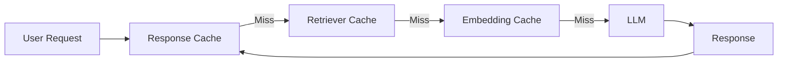

# Caching Strategies for LLM Applications

## Overview

Caching is the practice of storing previously computed results so they can be reused instead of recomputing them.

In LLM systems, caching reduces:

- Response latency
- API costs
- Token consumption
- Infrastructure load

Caching is one of the simplest and most effective optimizations for production AI applications.

---

## Why Caching Matters

Without caching:

```
User Request

↓

LLM

↓

Generate Response

↓

Return
```

Every request invokes the LLM.

With caching:

```
User Request

↓

Cache Lookup

↓

Cache Hit?
      ↓
 Yes        No
 ↓          ↓
Return    LLM
Cached    Generate
Result      ↓
            Store in Cache
```

If a response already exists, the LLM is never called.

---

# Types of Caching

## 1. Response Cache

Stores complete LLM responses.

Example:

```
User:
What is Kubernetes?

↓

Response stored
```

Next identical request:

```
Cache Hit

↓

Return Cached Response
```

### Best For

- FAQs
- Documentation bots
- Internal knowledge bases

---

## 2. Prompt Cache

Stores responses for identical prompts.

Example:

```
Prompt:

Summarize this document.
```

If the same prompt appears again:

```
Cache Hit
```

Useful when prompts are deterministic.

---

## 3. Embedding Cache

Embedding generation is expensive.

Instead of repeatedly generating embeddings:

```
Text

↓

Embedding Cache

↓

Existing?

↓

Yes → Reuse

No → Generate
```

Useful for:

- RAG pipelines
- Vector databases
- Document ingestion

---

## 4. Retrieval Cache

Cache retrieval results.

Example:

```
"What is our refund policy?"
```

Instead of querying the vector DB every time:

```
Return Cached Documents
```

---

## 5. Tool Result Cache

External APIs may be expensive.

Example:

```
Weather API

↓

Cache Result

↓

Reuse for 5 minutes
```

Useful for:

- Weather
- Currency rates
- Product catalogs
- Search APIs

---

## 6. KV Cache (Model-Level)

Large transformer models cache attention key/value tensors during inference.

Instead of recomputing previous tokens:

```
Prompt Tokens

↓

KV Cache

↓

Reuse Attention
```

This dramatically speeds up autoregressive generation.

KV Cache is internal to the model and different from application-level caching.

---

# Cache Levels

## Client Cache

Browser or mobile app.

Examples:

- Chat history
- User preferences

---

## Application Cache

Examples:

- Redis
- Memcached

Stores:

- Responses
- Retrievals
- Tool outputs

---

## Database Cache

Frequently accessed records.

---

## CDN Cache

Useful for:

- Static documents
- Images
- PDFs

---

# Cache Keys

A cache key uniquely identifies an entry.

Example:

```
Hash(

Prompt

+

Retrieved Docs

+

Prompt Version

+

Model Version

)
```

Avoid using only the prompt text.

Changes in:

- prompt template
- retrieved documents
- model version

should invalidate the cache.

---

# Cache Invalidation

One of the hardest problems in software.

Common strategies:

## Time-to-Live (TTL)

Example:

```
Weather

TTL = 5 minutes
```

---

## Version-Based

Invalidate when:

- prompt changes
- model changes
- embeddings change

---

## Event-Based

Invalidate after:

- document update
- policy update
- database change

---

# Cache Eviction Policies

## LRU (Least Recently Used)

Remove oldest unused entries.

Most common.

---

## LFU (Least Frequently Used)

Remove rarely accessed entries.

Useful for stable workloads.

---

## FIFO

First inserted, first removed.

Simple but less efficient.

---

# Production Architecture



Multiple cache layers reduce work throughout the pipeline.

---

# Caching in RAG

Possible cache points:

- Embeddings
- Retrieval results
- Re-ranked documents
- Final responses

Example:

```
User

↓

Embedding Cache

↓

Vector Search Cache

↓

LLM Response Cache
```

---

# Caching in Agents

Cache:

- Tool outputs
- API responses
- Planning results
- Intermediate computations

Example:

```
Currency API

↓

Cache for 10 minutes

↓

Reuse
```

---

# Production Metrics

Monitor:

- Cache hit rate
- Cache miss rate
- Average lookup latency
- Memory usage
- Eviction count
- Cost savings
- Token savings

---

# Best Practices

- Cache expensive operations.
- Use appropriate TTL values.
- Include prompt and model versions in cache keys.
- Monitor cache hit rate.
- Avoid caching highly personalized or sensitive responses.
- Invalidate caches when knowledge changes.

---

# Common Mistakes

- Caching stale responses
- Ignoring cache invalidation
- Using weak cache keys
- Caching sensitive information
- Very long TTLs for dynamic data

---

# Common Technologies

- Redis
- Memcached
- Cloudflare Cache
- AWS ElastiCache
- Azure Cache for Redis

---

# Interview Answer (30 sec)

> Caching improves LLM application performance by storing previously computed results and reusing them instead of recomputing them. Common caching layers include response caching, embedding caching, retrieval caching, tool result caching, and the model's internal KV cache. Effective caching reduces latency, API costs, and token usage.

---

# Interview Answer (2 min)

In production LLM systems, I use caching at multiple layers. Response caching avoids repeated model calls for identical requests. Embedding caching prevents regenerating vectors for the same documents, while retrieval caching reduces repeated vector database searches. For agent-based systems, I cache tool outputs such as weather or pricing APIs with appropriate TTLs. At the model level, transformer KV cache speeds up token generation by reusing attention states during inference.

An important consideration is cache invalidation. Cache keys should include prompt versions, model versions, and relevant document versions so stale responses aren't served after updates. I also monitor cache hit rate, latency improvements, and cost savings to evaluate caching effectiveness.

---

# Common Interview Questions

## What is caching in LLM applications?

Caching stores previously computed results so they can be reused, reducing latency, token usage, and API costs.

---

## What can be cached?

- LLM responses
- Prompt results
- Embeddings
- Retrieval results
- Tool outputs
- KV cache (inside transformer models)

---

## What is KV cache?

KV cache stores attention key/value tensors generated during inference so the model doesn't recompute attention for previous tokens. It significantly speeds up autoregressive generation.

---

## Why is embedding caching useful?

Generating embeddings is computationally expensive. Caching embeddings avoids repeated computation for identical documents or queries.

---

## How do you invalidate caches?

- Time-based expiration (TTL)
- Model version updates
- Prompt version updates
- Document updates
- Event-driven invalidation

---

## What metrics would you monitor?

- Cache hit rate
- Cache miss rate
- Lookup latency
- Memory usage
- Token savings
- Cost savings

---

## When should you avoid caching?

Avoid caching:

- Personalized responses
- Sensitive information
- Frequently changing data
- Non-deterministic outputs unless acceptable

---

# Common Follow-up Questions

### What's the difference between response cache and KV cache?

| Response Cache | KV Cache |
|---------------|----------|
| Application-level cache | Model-level optimization |
| Stores complete responses | Stores transformer attention states |
| Reduces API calls | Speeds up token generation |
| Works across requests | Exists only during inference |

---

### How does caching help RAG?

Caching embeddings, retrieval results, and final responses reduces vector database queries, lowers latency, and decreases token usage.

---

### How would you cache tool calls?

Cache deterministic or slowly changing API results (e.g., weather, exchange rates) with an appropriate TTL, while avoiding caching user-specific or transactional operations.

---

# Key Takeaways

- Caching is one of the highest-impact optimizations for production LLM systems.
- Cache at multiple layers: **responses, embeddings, retrievals, tools, and model inference (KV cache)**.
- Design robust cache keys and invalidation strategies.
- Continuously monitor cache hit rates, latency, and cost savings.
- Balance performance improvements with data freshness and correctness.
