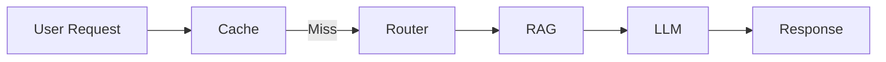

# Cost Optimization for LLM Applications

## Overview

Cost optimization is the process of reducing the operational cost of LLM applications while maintaining acceptable quality, latency, and reliability.

The primary cost drivers in LLM systems are:

- Model inference
- Token usage
- Embedding generation
- Vector database queries
- Tool/API calls
- Infrastructure

Production systems optimize costs through intelligent architecture rather than simply choosing cheaper models.

---

## Why Cost Optimization Matters

LLM applications can become expensive as usage grows.

Example:

```
1 million requests/day

↓

2,000 tokens/request

↓

2 billion tokens/day

↓

Significant monthly cost
```

Even small reductions in token usage or model selection can save substantial amounts at scale.

---

# Major Cost Drivers

## 1. Model Inference

The largest cost in most applications.

Factors:

- Model size
- Prompt tokens
- Completion tokens
- Number of requests

Large reasoning models cost significantly more than smaller models.

---

## 2. Token Usage

Every token contributes to cost.

```
Total Cost

=

Prompt Tokens

+

Completion Tokens
```

Reducing token usage is often the easiest optimization.

---

## 3. Embedding Generation

Embedding millions of documents can be expensive.

Optimization:

- Generate embeddings once
- Cache embeddings
- Reuse existing vectors

---

## 4. Retrieval

Each RAG request may perform:

- Vector search
- Re-ranking
- Metadata filtering

Reducing unnecessary retrieval lowers both latency and cost.

---

## 5. Tool Calls

External APIs may charge per request.

Examples:

- Search APIs
- Weather APIs
- Financial APIs
- OCR services

Cache results whenever appropriate.

---

# Cost Optimization Techniques

## 1. Model Routing

Use different models for different tasks.

Example:

```
FAQ

↓

Small Model
```

```
Complex reasoning

↓

Large Model
```

This is one of the highest-impact optimizations.

---

## 2. Prompt Optimization

Reduce unnecessary instructions.

Avoid:

```
Very long prompts
```

Prefer:

- concise system prompts
- reusable templates
- relevant context only

---

## 3. Context Optimization

Instead of sending:

```
Entire document
```

Retrieve only relevant chunks.

Benefits:

- Lower token usage
- Faster responses
- Better accuracy

---

## 4. Response Caching

If a response already exists:

```
Return Cached Response

↓

No LLM Call
```

Reduces both latency and API costs.

---

## 5. Embedding Caching

Avoid regenerating embeddings for unchanged documents.

---

## 6. Retrieval Optimization

Retrieve:

Top 5 relevant chunks

instead of

Top 50 chunks

Smaller contexts reduce token costs.

---

## 7. Streaming Responses

Streaming improves perceived latency and user experience, though it doesn't directly reduce token cost.

---

## 8. Output Length Control

Instead of allowing unlimited output:

```
Maximum 300 words.
```

This reduces completion tokens.

---

## 9. Batch Processing

Combine similar requests.

Example:

Generate embeddings for

100 documents

instead of

100 separate requests.

---

## 10. Fine-Tuning vs Prompt Engineering

If a prompt becomes extremely large:

Instead of:

```
Huge Prompt
```

Consider:

```
Fine-tuned Model

+

Short Prompt
```

This can reduce prompt token usage in some scenarios.

---

# RAG Cost Optimization

Optimize:

- Chunk size
- Chunk overlap
- Number of retrieved chunks
- Re-ranking
- Embedding model
- Vector search latency

Goal:

Smallest context that still answers correctly.

---

# Agent Cost Optimization

Agents may call multiple tools.

Instead of:

```
Tool A

↓

Tool B

↓

Tool C

↓

Tool D
```

Reduce unnecessary calls through:

- better planning
- tool validation
- caching
- stopping conditions

---

# Infrastructure Optimization

Examples:

- Autoscaling
- GPU sharing
- Dynamic batching
- Load balancing
- Right-sizing compute resources

---

# Monitoring Costs

Track:

- Cost per request
- Daily spend
- Monthly spend
- Token usage
- Cache hit rate
- Retrieval latency
- Model utilization
- Tool API costs

---

# Production Dashboard

Monitor:

- Prompt tokens
- Completion tokens
- Cost by model
- Cost by feature
- Cache hit rate
- Average request size
- Token trends

---

# Cost Optimization Workflow



Every stage contributes to reducing unnecessary work.

---

# Best Practices

- Use model routing.
- Cache expensive operations.
- Keep prompts concise.
- Retrieve only relevant context.
- Monitor token usage.
- Limit output length.
- Batch requests when possible.
- Continuously measure cost per request.

---

# Common Mistakes

- Sending excessive context
- Using the largest model for every task
- No caching
- Unlimited output length
- Ignoring token usage
- Recomputing embeddings
- Excessive tool calls

---

# Interview Answer (30 sec)

> Cost optimization in LLM applications involves reducing inference, token, retrieval, and infrastructure costs while maintaining quality. Common techniques include model routing, prompt optimization, response and embedding caching, efficient RAG retrieval, limiting output length, batching requests, and continuously monitoring token usage and cost metrics.

---

# Interview Answer (2 min)

I approach cost optimization as a system-wide effort rather than focusing on a single component. First, I route simple tasks to smaller models and reserve larger reasoning models for complex requests. I minimize prompt size by using reusable templates and retrieving only the most relevant context for RAG. I cache responses, embeddings, and tool results whenever possible to avoid repeated computation.

I also control output length, batch operations such as embedding generation, and monitor metrics including token usage, cache hit rate, cost per request, and model utilization. By combining these techniques, it's possible to significantly reduce operational costs while maintaining a high-quality user experience.

---

# Common Interview Questions

## Why are LLM applications expensive?

The primary contributors are:

- Model inference
- Token usage
- Embedding generation
- Retrieval
- Tool/API calls
- Infrastructure

---

## What's the biggest contributor to cost?

For most production systems:

1. Model inference
2. Token usage

These two usually dominate overall cost.

---

## How do you reduce token usage?

- Shorter prompts
- Smaller retrieved context
- Concise responses
- Prompt templates
- Output length limits

---

## How does caching reduce cost?

Caching avoids repeated LLM inference, embedding generation, retrieval, and external API calls, reducing both latency and infrastructure expenses.

---

## How does model routing reduce cost?

Simple requests are handled by lower-cost models, while only complex tasks use expensive reasoning models.

---

## How do you optimize a RAG pipeline?

- Tune chunk size
- Reduce overlap
- Retrieve fewer, higher-quality chunks
- Use re-ranking
- Cache retrieval results
- Choose an appropriate embedding model

---

## What metrics would you monitor?

- Cost per request
- Token usage
- Cache hit rate
- Model utilization
- Daily spend
- Latency
- User satisfaction

---

# Common Follow-up Questions

### Is the cheapest model always the best choice?

No. The goal is to minimize **total cost while maintaining quality**. A slightly more expensive model that produces accurate answers on the first attempt may be cheaper overall than repeated retries or user escalations.

---

### How do you balance cost and quality?

Measure both. Track evaluation metrics (accuracy, groundedness, user satisfaction) alongside operational metrics (cost per request, latency, token usage). Optimize for the best trade-off rather than the lowest cost.

---

### How would you reduce costs by 30%?

Possible approaches:

1. Introduce model routing.
2. Cache common responses and embeddings.
3. Reduce prompt and context size.
4. Limit output length.
5. Optimize retrieval.
6. Batch embedding jobs.
7. Monitor and eliminate unnecessary tool calls.

---

# Key Takeaways

- Cost optimization is a **cross-cutting concern** that spans prompting, RAG, routing, caching, and infrastructure.
- The biggest cost drivers are **model inference and token usage**.
- High-impact optimizations include **model routing, caching, prompt optimization, efficient retrieval, and output length control**.
- Continuously monitor cost, latency, and quality to ensure optimizations do not negatively affect the user experience.
