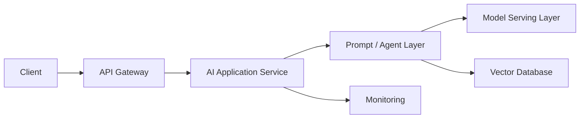

# Deployment Patterns for LLM Applications

## Overview

Deployment patterns define how LLM applications are packaged, hosted, scaled, and operated in production.

Unlike traditional applications, LLM systems have unique deployment considerations:

- Large model sizes
- High inference costs
- Variable latency
- GPU requirements
- Model version management
- Safety and evaluation requirements

A production AI system usually separates:

- Application layer
- Model layer
- Data layer
- Infrastructure layer

---

# High-Level LLM Production Architecture



---

# Common Deployment Patterns

## 1. API-Based Model Deployment

The application calls a hosted LLM API.

Examples:

- OpenAI API
- Anthropic API
- Cloud provider model APIs

Architecture:

```
Application

↓

LLM API

↓

Response
```

---

## Advantages

- No infrastructure management
- Fast development
- Automatic scaling
- Access to large models

---

## Disadvantages

- Vendor dependency
- Data privacy considerations
- Usage-based cost
- Limited model customization

---

## Best Use Cases

- Startups
- Prototypes
- Applications requiring state-of-the-art models

---

# 2. Self-Hosted Model Deployment

The organization hosts the model internally.

Architecture:

```
Application

↓

Model Server

↓

GPU Infrastructure

↓

LLM
```

Examples:

- Llama
- Mistral
- Falcon

---

## Advantages

- Full control
- Data privacy
- Custom optimization
- Predictable costs at scale

---

## Disadvantages

- Requires GPU infrastructure
- Operational complexity
- Model optimization required

---

## Best Use Cases

- Enterprise applications
- Sensitive data
- High-volume workloads

---

# 3. Hybrid Deployment

Combine hosted APIs and self-hosted models.

Example:

```
Simple Requests

↓

Internal Small Model


Complex Requests

↓

External Large Model
```

Benefits:

- Cost optimization
- Data control
- Flexibility

---

# 4. Microservice Architecture

Separate AI capabilities into independent services.

Example:

```
API Service

↓

RAG Service

↓

Embedding Service

↓

Model Service

↓

Tool Service
```

---

## Benefits

- Independent scaling
- Easier maintenance
- Better fault isolation

---

## Example Services

```
/chat

/document-ingestion

/retrieval

/embedding

/evaluation

/model-inference
```

---

# 5. Serverless Deployment

Run AI workflows without managing servers.

Examples:

- AWS Lambda
- Cloud Functions

Good for:

- Lightweight orchestration
- Pre/post processing
- API endpoints

---

Limitations:

- Cold starts
- Execution limits
- Not suitable for large model inference

---

# 6. Container-Based Deployment

Package AI services using containers.

Example:

```
Docker Container

↓

AI Application

↓

Dependencies

↓

Runtime
```

Common platforms:

- Kubernetes
- ECS
- GKE
- AKS

---

## Benefits

- Consistent environments
- Easy scaling
- Portable deployments

---

# 7. Kubernetes Deployment

Kubernetes manages production AI workloads.

Architecture:

```
Load Balancer

↓

Kubernetes Service

↓

AI Pods

↓

GPU Nodes
```

Used for:

- Large-scale inference
- Multiple models
- Auto-scaling

---

# Model Serving Patterns

## 1. Dedicated Model Server

One model per service.

Example:

```
Chat Service

↓

GPT Model Server
```

Benefits:

- Simple
- Predictable

---

## 2. Multi-Model Serving

One infrastructure hosts multiple models.

Example:

```
Model Server

├── Embedding Model
├── Classification Model
└── Generation Model
```

Benefits:

- Better resource utilization

---

## 3. Dynamic Model Loading

Load models only when needed.

Example:

```
Request

↓

Load Model

↓

Inference

↓

Unload
```

Useful when GPU memory is limited.

---

# Scaling Patterns

## Horizontal Scaling

Add more inference servers.

```
1 GPU Server

↓

10 GPU Servers
```

Useful for high traffic.

---

## Vertical Scaling

Increase machine capacity.

Example:

```
1 GPU

↓

8 GPUs
```

Useful for larger models.

---

## Auto Scaling

Scale based on:

- Requests/sec
- GPU utilization
- Queue length
- Latency

---

# Inference Optimization

Deployment often includes:

## Quantization

Reduce model precision.

Example:

```
FP16

↓

INT8
```

Benefits:

- Lower memory usage
- Faster inference

---

## Batching

Combine multiple requests.

Example:

```
Request 1
Request 2
Request 3

↓

Single GPU Batch
```

Improves throughput.

---

## Streaming

Return tokens as generated.

Benefits:

- Better user experience
- Lower perceived latency

---

# Model Version Management

Treat models like software releases.

Example:

```
Model v1

↓

Evaluation

↓

Model v2

↓

A/B Testing

↓

Production
```

Track:

- Model version
- Prompt version
- Embedding version

---

# CI/CD for LLM Applications

Pipeline:

```
Code Change

↓

Unit Tests

↓

Prompt Evaluation

↓

Safety Checks

↓

Deployment

↓

Monitoring
```

---

# Blue-Green Deployment

Run two versions:

```
Production

↓

Version A


New Version

↓

Version B
```

Switch traffic after validation.

---

# Canary Deployment

Release gradually.

Example:

```
5% Users

↓

Monitor

↓

50%

↓

100%
```

Useful for:

- New models
- New prompts
- New agents

---

# Security Considerations

Production deployments should include:

- Authentication
- Authorization
- Encryption
- PII protection
- Rate limiting
- Audit logging
- Network isolation

---

# Disaster Recovery

Plan for:

- Model service failures
- Provider outages
- Data corruption
- High traffic spikes

Strategies:

- Multiple model providers
- Fallback models
- Replicated databases
- Backup vector stores

---

# Deployment Metrics

Monitor:

## Performance

- Latency
- Throughput
- Error rate
- Availability

## AI Quality

- Accuracy
- Hallucination rate
- User feedback

## Infrastructure

- CPU usage
- GPU utilization
- Memory usage

## Cost

- Token usage
- Compute cost
- API spend

---

# Best Practices

- Separate application and model layers.
- Containerize AI services.
- Use automated evaluation before deployment.
- Version prompts and models.
- Implement rollback strategies.
- Monitor quality and infrastructure together.
- Use caching and routing to control cost.

---

# Common Mistakes

- Deploying without evaluation
- No rollback strategy
- No model versioning
- Ignoring GPU utilization
- Treating LLMs like traditional APIs
- No monitoring after deployment

---

# Interview Answer (30 sec)

> Deployment patterns for LLM applications involve selecting the right architecture for hosting models, scaling inference, and managing production reliability. Common patterns include API-based deployment, self-hosted models, hybrid deployments, microservices, and containerized model serving. Production systems also require model versioning, monitoring, evaluation pipelines, and rollback strategies.

---

# Interview Answer (2 min)

For deploying LLM applications, I separate the application layer from the model-serving layer. Depending on requirements, I choose between managed APIs, self-hosted models, or hybrid architectures. For enterprise systems requiring privacy and high volume, self-hosted or hybrid approaches are common.

I typically containerize services and deploy them using Kubernetes for scalability. The deployment pipeline includes automated testing, prompt evaluation, safety checks, model versioning, and gradual rollout strategies such as canary deployments. I monitor both infrastructure metrics like latency and GPU utilization and AI metrics like hallucination rate and user satisfaction. This ensures the system remains reliable as usage grows.

---

# Common Interview Questions

## What are common deployment patterns for LLM applications?

- API-based deployment
- Self-hosted models
- Hybrid deployment
- Microservices
- Container-based deployment
- Kubernetes-based deployment

---

## When would you self-host an LLM?

When requirements include:

- Data privacy
- Compliance
- High request volume
- Custom model optimization
- Predictable cost

---

## What factors influence deployment decisions?

- Data sensitivity
- Traffic volume
- Latency requirements
- Cost
- Model size
- Customization needs
- Operational maturity

---

## How do you deploy a new model safely?

1. Evaluate offline.
2. Run safety checks.
3. Deploy using canary release.
4. Monitor metrics.
5. Roll back if quality drops.

---

## How do you scale LLM inference?

Use:

- Horizontal scaling
- GPU optimization
- Batching
- Quantization
- Caching
- Load balancing

---

## What is the difference between model hosting and model serving?

| Model Hosting | Model Serving |
|---|---|
| Storing and managing models | Providing inference APIs |
| Infrastructure concern | Runtime execution |
| Model lifecycle | Request handling |

---

# Key Takeaways

- LLM deployment requires managing both software and AI-specific challenges.
- Common patterns include API, self-hosted, hybrid, microservice, and Kubernetes deployments.
- Production systems require evaluation, monitoring, versioning, and rollback strategies.
- Optimize inference using batching, quantization, caching, and scaling.
- Treat models and prompts as production artifacts that need lifecycle management.
