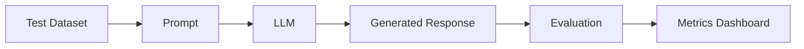

# LLM Evaluation

## Overview

LLM evaluation is the process of measuring the quality, reliability, safety, and performance of Large Language Model applications.

Unlike traditional software, LLMs produce probabilistic outputs, making evaluation essential for understanding model behavior and ensuring production readiness.

Evaluation helps answer questions such as:

- Is the response correct?
- Is it grounded in the provided context?
- Does it hallucinate?
- Is the output safe?
- Is the response useful to users?

---

## Why Evaluation Matters

Without evaluation, it's difficult to:

- Compare prompts
- Compare models
- Measure improvements
- Detect regressions
- Validate production changes

Evaluation enables data-driven decisions instead of relying on subjective opinions.

---

# Evaluation Types

## 1. Offline Evaluation

Uses pre-collected datasets with known expected outputs.

Examples:

- Benchmark datasets
- Question-answer pairs
- Golden datasets

Advantages:

- Repeatable
- Fast
- Easy to automate

Limitations:

- Doesn't reflect real users
- May become outdated

---

## 2. Online Evaluation

Measures production performance using live user interactions.

Examples:

- User feedback
- Click-through rate
- Task completion
- A/B testing

Advantages:

- Reflects real-world behavior
- Captures changing user needs

Limitations:

- Requires production traffic
- Slower feedback loop

---

## 3. Human Evaluation

Experts manually review outputs.

Typical criteria:

- Accuracy
- Completeness
- Helpfulness
- Fluency
- Safety

Useful for:

- High-risk domains
- Final validation
- Subjective quality

---

## 4. LLM-as-a-Judge

One LLM evaluates another model's output using predefined criteria.

Example:

```
Prompt

↓

Candidate Response

↓

Judge LLM

↓

Score + Explanation
```

Advantages:

- Fast
- Scalable
- Low cost

Limitations:

- Judge model may also be biased or inaccurate

---

# Common Evaluation Metrics

## Accuracy

Is the answer factually correct?

Example:

```
Question:
Capital of France?

Answer:
Paris
```

---

## Groundedness

Is every claim supported by the retrieved documents?

Important for RAG systems.

---

## Hallucination Rate

Percentage of responses containing unsupported information.

Lower is better.

---

## Relevance

Does the response answer the user's question?

---

## Completeness

Does the response fully address the request?

---

## Faithfulness

Does the answer accurately reflect the retrieved context without adding unsupported information?

---

## Context Precision

How much of the retrieved context is actually relevant?

High precision means little irrelevant information.

---

## Context Recall

Did retrieval find all the information needed to answer the question?

---

## Latency

Time taken to generate the response.

Measured in:

- First token latency
- Total response time

---

## Token Usage

Measure:

- Prompt tokens
- Completion tokens
- Cost per request

---

## Safety Metrics

Examples:

- Toxicity
- Bias
- PII leakage
- Policy violations
- Prompt injection success rate

---

# RAG Evaluation

A RAG system has two major components:

```
Retriever

↓

Generator
```

Both should be evaluated independently.

---

## Retriever Metrics

- Precision@K
- Recall@K
- Mean Reciprocal Rank (MRR)
- Normalized Discounted Cumulative Gain (NDCG)

These measure retrieval quality.

---

## Generator Metrics

- Faithfulness
- Groundedness
- Completeness
- Hallucination rate
- Answer relevance

---

# Evaluation Pipeline



---

# Golden Dataset

A curated set of high-quality examples.

Contains:

- User query
- Expected answer
- Retrieved documents
- Evaluation criteria

Used for:

- Regression testing
- Prompt comparison
- Model comparison

---

# A/B Testing

Compare two versions.

Example:

```
Prompt V1

↓

Accuracy = 84%

Prompt V2

↓

Accuracy = 90%
```

Deploy the better-performing version.

---

# Continuous Evaluation

Production systems continuously evaluate:

- New prompts
- New models
- New retrieval strategies
- New embedding models

Evaluation is integrated into CI/CD pipelines.

---

# Production Monitoring

Track:

- Accuracy
- Hallucination rate
- Latency
- Token usage
- Tool success rate
- Retrieval quality
- User satisfaction
- Failure rate

---

# Common Evaluation Frameworks

- LangSmith
- Ragas
- DeepEval
- TruLens
- OpenAI Evals
- Promptfoo

---

# Best Practices

- Build a representative golden dataset.
- Evaluate retrieval and generation separately.
- Combine automated and human evaluation.
- Track both quality and latency.
- Re-evaluate after prompt or model changes.
- Monitor production continuously.

---

# Common Mistakes

- Evaluating only the model and ignoring retrieval
- Using a very small test dataset
- Measuring only accuracy
- Ignoring latency and cost
- No regression testing after updates

---

# Interview Answer (30 sec)

> LLM evaluation measures the quality, reliability, safety, and performance of an AI application. It includes offline evaluation using golden datasets, online evaluation with real user interactions, human evaluation, and LLM-as-a-Judge. In production, we track metrics such as accuracy, groundedness, hallucination rate, latency, and user satisfaction to continuously improve the system.

---

# Interview Answer (2 min)

I view LLM evaluation as a continuous process rather than a one-time benchmark. I typically build a golden dataset with representative user queries and expected responses for offline testing. For RAG systems, I evaluate retrieval quality separately using metrics like Precision@K and Recall@K, and generation quality using groundedness, faithfulness, and hallucination rate.

Before deployment, I compare prompts or models through automated evaluations and human review. After deployment, I monitor production metrics such as latency, token usage, user feedback, and failure rates. I also use A/B testing to compare prompt or model versions and integrate evaluation into CI/CD so regressions are detected before reaching users.

---

# Common Interview Questions

## What is LLM evaluation?

LLM evaluation measures how accurately, safely, and reliably an LLM application performs across different tasks and production scenarios.

---

## Why is evaluation important?

Evaluation enables objective comparison of prompts, models, retrieval strategies, and system changes while detecting regressions before they impact users.

---

## What is a golden dataset?

A curated collection of representative inputs, expected outputs, and evaluation criteria used for repeatable testing.

---

## What is LLM-as-a-Judge?

A technique where one LLM evaluates another model's output according to predefined criteria such as accuracy, relevance, or completeness.

---

## How do you evaluate a RAG system?

Evaluate the retriever and generator separately.

Retriever:

- Precision@K
- Recall@K
- MRR
- NDCG

Generator:

- Faithfulness
- Groundedness
- Completeness
- Hallucination rate
- Answer relevance

---

## What metrics do you monitor in production?

- Accuracy
- Hallucination rate
- Groundedness
- Latency
- Token usage
- Retrieval quality
- User satisfaction
- Tool success rate
- Safety violations

---

## What's the difference between offline and online evaluation?

| Offline Evaluation | Online Evaluation |
|--------------------|-------------------|
| Uses historical datasets | Uses real user traffic |
| Repeatable | Reflects real-world usage |
| Good for regression testing | Good for continuous improvement |

---

## Can automated evaluation replace human evaluation?

No. Automated evaluation scales well, but human evaluation is still important for subjective qualities such as helpfulness, tone, and domain-specific correctness.

---

# Common Follow-up Questions

### How often should you evaluate an LLM application?

- After prompt updates
- After model upgrades
- After retrieval changes
- Before production releases
- Continuously in production

---

### How do you detect regressions?

Compare new prompts or models against the golden dataset and monitor production metrics for drops in quality, increases in hallucinations, or latency regressions.

---

### What's the biggest challenge in LLM evaluation?

Unlike deterministic software, there may be multiple valid answers. This makes evaluation more complex and often requires combining automated metrics with human judgment.

---

# Key Takeaways

- Evaluation is essential for building reliable production LLM applications.
- Measure **both retrieval and generation** in RAG systems.
- Combine offline testing, online monitoring, human review, and automated evaluation.
- Track quality, safety, latency, and cost—not just accuracy.
- Integrate evaluation into your deployment pipeline to catch regressions early.
