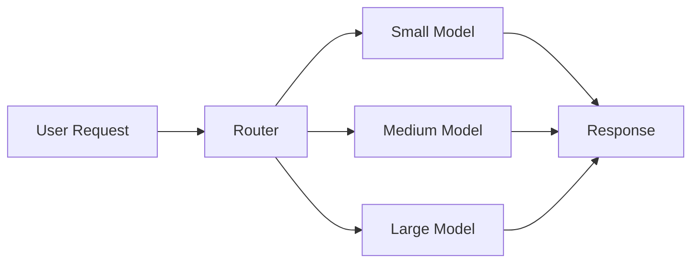
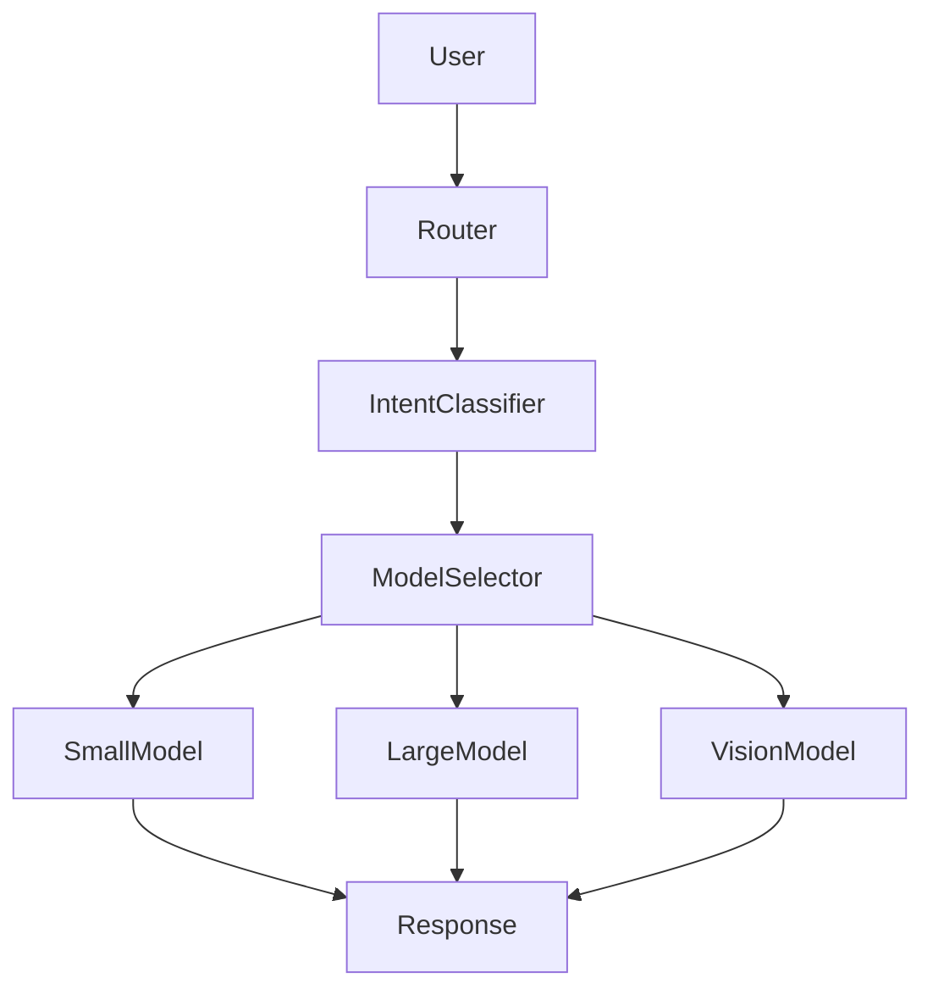

# Model Routing

## Overview

Model routing is the process of selecting the most appropriate Large Language Model (LLM) for a given request based on factors such as task complexity, latency, cost, accuracy, or domain.

Instead of sending every request to the most powerful (and expensive) model, production systems use a routing layer to optimize performance, cost, and user experience.

---

## Why Model Routing Matters

Using a single model for all requests can lead to:

- Higher costs
- Increased latency
- Underutilization of smaller models
- Poor scalability

A routing layer helps balance quality and efficiency.

---

## High-Level Architecture



The router decides which model should handle the request.

---

# Why Not Use GPT-5 for Everything?

Although large models generally provide the best reasoning capabilities, they are:

- More expensive
- Slower
- Higher token cost
- Limited throughput

Simple tasks do not require the most capable model.

Example:

```
Translate text

↓

Small Model
```

```
Design distributed architecture

↓

Large Reasoning Model
```

---

# Routing Strategies

## 1. Rule-Based Routing

The simplest approach.

Example:

```
If task == Translation

↓

Small Model

If task == Coding

↓

Large Model
```

Advantages:

- Easy to implement
- Predictable

Disadvantages:

- Difficult to scale
- Hard-coded rules

---

## 2. Cost-Based Routing

Choose the least expensive model capable of solving the task.

Example:

```
FAQ

↓

Small Model

Research Question

↓

Large Model
```

Useful when minimizing API cost.

---

## 3. Latency-Based Routing

Prioritize response speed.

Example:

```
Real-time Chat

↓

Fast Model

Complex Analysis

↓

Large Model
```

---

## 4. Capability-Based Routing

Select models according to strengths.

Example:

| Task | Model |
|------|-------|
| Coding | Code-specialized model |
| Vision | Multimodal model |
| Summarization | Small language model |
| Complex reasoning | Large reasoning model |

---

## 5. Confidence-Based Routing

Start with a smaller model.

If confidence is low:

```
Small Model

↓

Confidence Check

↓

Escalate

↓

Large Model
```

This minimizes cost while maintaining quality.

---

## 6. Hybrid Routing

Combine multiple routing strategies.

Decision factors:

- Cost
- Latency
- Confidence
- User tier
- Task complexity

Most enterprise systems use hybrid routing.

---

# Example Routing Flow

```
User Request

↓

Task Classification

↓

Simple?

↓

Yes

↓

Small Model

↓

Done

No

↓

Large Model
```

---

# Routing Based on User Tier

Example:

Free users:

↓

Smaller model

Premium users:

↓

Larger reasoning model

This balances infrastructure cost.

---

# Routing Based on Token Size

Small requests:

↓

Lightweight model

Long documents:

↓

Large-context model

---

# Routing Based on Domain

Medical

↓

Medical-tuned model

Legal

↓

Legal model

Coding

↓

Coding model

General Chat

↓

General-purpose model

---

# Fallback Routing

If the primary model fails:

```
Primary Model

↓

Failure

↓

Fallback Model
```

Improves reliability.

---

# Multi-Model Pipelines

Some systems use multiple models for one request.

Example:

```
Small Model

↓

Classify Intent

↓

Large Model

↓

Reason

↓

Small Model

↓

Summarize
```

Each model performs the task it is best suited for.

---

# Production Architecture



---

# Evaluation Metrics

Monitor:

- Routing accuracy
- Cost per request
- Average latency
- User satisfaction
- Escalation rate
- Model utilization
- Failure rate

---

# Best Practices

- Route simple tasks to smaller models.
- Reserve expensive models for complex reasoning.
- Implement fallback models.
- Continuously evaluate routing decisions.
- Monitor cost, latency, and quality.
- Keep routing logic configurable.

---

# Common Mistakes

- Using one model for everything
- Hardcoding routing rules
- Ignoring model costs
- No fallback strategy
- No monitoring of routing decisions

---

# Real-World Examples

### Customer Support

- FAQs → Small model
- Billing disputes → Larger reasoning model
- Account actions → Tool-enabled model

---

### Coding Assistant

- Syntax questions → Small model
- System design → Large reasoning model
- Code explanation → Medium model

---

### Enterprise Search

- Document retrieval → Small model
- Multi-document reasoning → Large model

---

# Common Frameworks

- LangGraph
- LangChain Router Chains
- LlamaIndex Router
- Semantic Router
- Custom routing services

---

# Interview Answer (30 sec)

> Model routing is the process of selecting the most appropriate model for a request based on factors such as task complexity, cost, latency, or required capabilities. Production systems use routing to optimize both user experience and infrastructure costs instead of sending every request to the largest model.

---

# Interview Answer (2 min)

In production AI systems, I introduce a routing layer between the user and the available models. The router evaluates characteristics such as task type, complexity, latency requirements, token length, user tier, and model confidence to determine which model should handle the request.

For example, simple classification or summarization tasks may go to a smaller, lower-cost model, while complex reasoning or coding tasks are routed to a larger model. I also implement fallback models for reliability and monitor routing metrics such as latency, cost, escalation rate, and user satisfaction. This approach improves scalability while keeping operational costs under control.

---

# Common Interview Questions

## What is model routing?

Model routing is the process of dynamically selecting the best model for a request based on predefined criteria such as complexity, latency, cost, or capabilities.

---

## Why is model routing important?

It reduces cost, improves latency, increases scalability, and ensures that expensive models are used only when necessary.

---

## What factors influence routing decisions?

- Task complexity
- Cost
- Latency
- Token length
- User subscription tier
- Domain
- Model confidence
- Required capabilities

---

## What is confidence-based routing?

A smaller model attempts the task first. If its confidence is low or the answer fails validation, the request is escalated to a more capable model.

---

## Why implement fallback models?

Fallback models improve reliability by allowing requests to continue if the preferred model is unavailable or overloaded.

---

## What metrics would you monitor?

- Cost per request
- Average latency
- Routing accuracy
- Escalation rate
- Model utilization
- Failure rate
- User satisfaction

---

# Common Follow-up Questions

### How would you design routing for a customer support chatbot?

1. Classify user intent.
2. Route FAQs to a small model.
3. Route complex troubleshooting to a larger reasoning model.
4. Route account-specific actions through authenticated tool-calling workflows.
5. Use fallback models if the preferred model is unavailable.

---

### Can routing decisions change during execution?

Yes. An agent may start with one model, then switch to another if:
- additional reasoning is required,
- context grows significantly,
- confidence is low,
- specialized capabilities (e.g., vision) become necessary.

---

### What's the difference between model routing and tool routing?

| Model Routing | Tool Routing |
|--------------|--------------|
| Chooses which LLM to use | Chooses which external tool to call |
| Optimizes cost and quality | Extends model capabilities |
| Happens before or during inference | Happens during agent execution |

---

# Key Takeaways

- Model routing is a **decision layer** that optimizes cost, latency, and quality.
- Production systems rarely rely on a single model for every request.
- Common strategies include **rule-based, cost-based, latency-based, capability-based, confidence-based, and hybrid routing**.
- Continuously monitor routing decisions and adjust policies based on production metrics.
