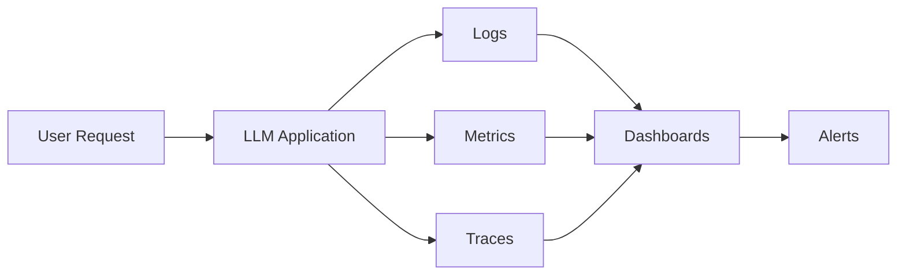

# Observability & Monitoring

## Overview

Observability is the ability to understand the internal behavior of an LLM application by collecting logs, metrics, traces, and user feedback.

Monitoring is the continuous tracking of these signals to detect failures, regressions, and performance issues in production.

While monitoring tells you **that** something is wrong, observability helps you understand **why**.

---

## Why Observability Matters

LLMs are probabilistic systems. Unlike traditional software, failures are often subtle:

- Hallucinated answers
- Poor retrieval
- Wrong tool selection
- Prompt failures
- Increased latency
- Cost spikes
- Declining answer quality

Without observability, these issues are difficult to detect and diagnose.

---

# Observability Architecture



Every request should generate telemetry that can be analyzed later.

---

# The Three Pillars of Observability

## 1. Logs

Logs capture detailed information about individual requests.

Typical fields include:

- Request ID
- User ID (anonymized)
- Model used
- Prompt version
- Retrieved documents
- Tool calls
- Tokens used
- Latency
- Errors

Example:

```json
{
  "request_id": "12345",
  "model": "gpt-4.1",
  "prompt_version": "v3",
  "latency_ms": 850,
  "tokens": 1420,
  "tool_called": "search_documents",
  "status": "success"
}
```

Logs are primarily used for debugging.

---

## 2. Metrics

Metrics aggregate system behavior over time.

Common metrics:

### Quality

- Accuracy
- Hallucination rate
- Groundedness
- Answer relevance
- User satisfaction

### Performance

- Request volume
- Response latency
- First token latency
- Error rate
- Timeout rate

### Cost

- Prompt tokens
- Completion tokens
- Cost per request
- Daily token usage

### RAG

- Retrieval latency
- Precision@K
- Recall@K
- Context relevance

### Agents

- Tool call success rate
- Average tools per request
- Planning failures

Metrics power dashboards and alerts.

---

## 3. Traces

Tracing follows an individual request through the entire system.

Example:

```
User Query

↓

Retriever

↓

Vector DB

↓

LLM

↓

Tool Call

↓

Output Validation

↓

Response
```

Tracing helps identify where failures occur.

---

# Monitoring Dashboards

Typical production dashboards include:

## Quality Dashboard

- Accuracy
- Hallucination rate
- User feedback
- Evaluation scores

---

## Performance Dashboard

- P50 latency
- P95 latency
- P99 latency
- Throughput
- Error rate

---

## Cost Dashboard

- Daily token usage
- Cost by model
- Average request cost
- Cache hit rate

---

## RAG Dashboard

- Retrieval latency
- Context precision
- Context recall
- Re-ranking effectiveness

---

## Agent Dashboard

- Tool usage frequency
- Tool failures
- Retry count
- Average planning steps

---

# Alerting

Production systems should automatically alert when thresholds are exceeded.

Examples:

Hallucination rate > 5%

↓

Alert

---

P95 latency > 3 seconds

↓

Alert

---

Tool failures > 2%

↓

Alert

---

Daily cost exceeds budget

↓

Alert

---

# Common Metrics

## Latency

Measure:

- Time to first token (TTFT)
- Total response time

---

## Throughput

Requests processed per second or minute.

---

## Availability

Percentage of successful requests.

Example:

99.9% uptime

---

## Error Rate

Percentage of failed requests.

Includes:

- API failures
- Tool failures
- Timeout errors
- Validation failures

---

## Token Metrics

Track:

- Prompt tokens
- Completion tokens
- Total tokens
- Token cost

Useful for cost optimization.

---

# Monitoring RAG Systems

Monitor both retrieval and generation.

Retriever:

- Retrieval latency
- Precision@K
- Recall@K
- Missing document rate

Generator:

- Hallucination rate
- Faithfulness
- Groundedness
- Completeness

---

# Monitoring Agent Systems

Track:

- Planning success
- Tool success rate
- Tool retries
- Failed tool calls
- Infinite loops
- Average reasoning steps

---

# User Feedback

Production systems often collect:

👍 Helpful

👎 Not Helpful

Comments

Ratings

This feedback becomes valuable evaluation data.

---

# Production Logging Best Practices

Log:

- Prompt version
- Model version
- Retrieval results
- Tool calls
- Latency
- Token usage
- Errors

Avoid logging:

- Passwords
- Secrets
- Sensitive personal information

---

# Common Observability Tools

General:

- Datadog
- Grafana
- Prometheus
- OpenTelemetry

LLM-specific:

- LangSmith
- Langfuse
- Helicone
- Phoenix (Arize)
- Weights & Biases Weave

---

# Best Practices

- Instrument every stage of the pipeline.
- Correlate logs, metrics, and traces using a request ID.
- Monitor both quality and infrastructure metrics.
- Track prompt and model versions.
- Set alerts for latency, failures, and hallucinations.
- Use dashboards for continuous visibility.

---

# Common Mistakes

- Monitoring only infrastructure metrics
- Ignoring answer quality
- Not tracing tool calls
- Not versioning prompts
- No alerting on hallucination spikes
- Logging sensitive information

---

# Interview Answer (30 sec)

> Observability in LLM systems is the ability to understand application behavior using logs, metrics, and traces. In production, I monitor not only infrastructure metrics like latency and errors, but also AI-specific metrics such as hallucination rate, groundedness, retrieval quality, tool success rate, token usage, and user feedback. This helps quickly detect and diagnose quality regressions.

---

# Interview Answer (2 min)

For production LLM systems, I implement observability across the entire request pipeline. Every request is assigned a unique ID so I can correlate logs, metrics, and traces. I log prompt versions, model versions, retrieved documents, tool calls, token usage, and latency for debugging.

I monitor infrastructure metrics such as latency, throughput, and error rate alongside AI-specific metrics including hallucination rate, groundedness, retrieval precision, tool success rate, and user feedback. For RAG systems, I separately monitor retrieval and generation quality. I also configure alerts for latency spikes, increasing hallucinations, tool failures, and abnormal cost increases. This combination of observability and monitoring enables rapid diagnosis of production issues and continuous improvement.

---

# Common Interview Questions

## What is observability?

Observability is the ability to understand how an LLM application behaves internally using logs, metrics, traces, and telemetry.

---

## What's the difference between monitoring and observability?

| Monitoring | Observability |
|------------|---------------|
| Detects problems | Explains why problems occur |
| Focuses on predefined metrics | Provides deep system visibility |
| Uses dashboards and alerts | Uses logs, metrics, traces, and debugging data |

---

## What AI-specific metrics would you monitor?

- Hallucination rate
- Groundedness
- Faithfulness
- Retrieval precision
- Retrieval recall
- Tool success rate
- User satisfaction
- Token usage
- Cost per request

---

## What should be logged for every request?

- Request ID
- Prompt version
- Model version
- Retrieved documents
- Tool calls
- Latency
- Token usage
- Errors

---

## How do you monitor a RAG application?

Monitor the retriever and generator separately. Measure retrieval quality (Precision@K, Recall@K, latency) and generation quality (groundedness, faithfulness, hallucination rate).

---

## How do you monitor an AI agent?

Track planning success, tool usage, retries, failed tool calls, reasoning steps, execution latency, and overall task completion.

---

## How do you control production costs?

Monitor:

- Token consumption
- Cost per request
- Cache hit rate
- Model usage
- Request volume

Use dashboards and alerts to detect unexpected cost spikes.

---

# Common Follow-up Questions

### Why are traces important?

Traces show the complete lifecycle of a request, making it easy to identify whether failures originate in retrieval, tool execution, model inference, or output validation.

---

### How do you investigate a hallucination report?

1. Review the request trace.
2. Check retrieved documents.
3. Verify prompt version.
4. Inspect tool calls.
5. Determine whether the issue was retrieval, prompting, or model generation.
6. Add the case to the evaluation dataset if needed.

---

### Which tools have you used?

Examples include:

- Datadog
- Grafana
- LangSmith
- Langfuse
- Helicone
- Arize Phoenix
- OpenTelemetry

---

# Key Takeaways

- Observability provides visibility into **why** an AI system behaves the way it does.
- Monitor both **system health** (latency, errors, cost) and **AI quality** (hallucinations, retrieval quality, tool success).
- Use logs, metrics, traces, dashboards, and alerts together.
- Good observability is essential for operating reliable production LLM systems at scale.
