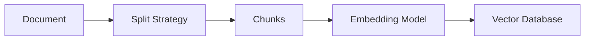
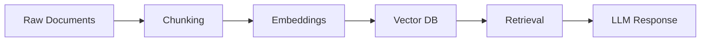

# Chunking

## Overview

Chunking is the process of splitting large documents into smaller, manageable pieces (called chunks) before converting them into embeddings for Retrieval-Augmented Generation (RAG).

Since embedding models and LLMs have token limits, we cannot process entire documents as a single unit. Chunking makes retrieval efficient and accurate.

---

## Why Chunking is Needed

Large documents cannot be embedded or retrieved as a whole because:

- Context windows are limited
- Embedding quality degrades on long text
- Retrieval becomes less precise
- Irrelevant sections reduce accuracy

Chunking solves this by breaking text into meaningful segments.

---

## How Chunking Works



Each chunk is embedded and stored independently.

---

## Example

Original document:

```text
Refund Policy:

- Refunds are allowed within 30 days.
- Processing takes 5–7 business days.
- Digital products are non-refundable.
```

### Chunked version:

Chunk 1:
```text
Refund Policy: Refunds are allowed within 30 days.
```

Chunk 2:
```text
Processing takes 5–7 business days.
```

Chunk 3:
```text
Digital products are non-refundable.
```

---

## Types of Chunking Strategies

### 1. Fixed-Size Chunking

Splits text by a fixed number of tokens or characters.

Example:
```
Chunk size = 200 tokens
Overlap = 20 tokens
```

Pros:
- Simple to implement
- Fast

Cons:
- May break sentences or meaning
- Poor semantic alignment

---

### 2. Sentence-Based Chunking

Splits text by sentences.

Example:
```
Sentence 1 → Chunk 1
Sentence 2 → Chunk 2
```

Pros:
- Preserves readability
- Better semantic structure

Cons:
- Uneven chunk sizes

---

### 3. Paragraph-Based Chunking

Splits by paragraphs.

Pros:
- Natural semantic boundaries
- Easy to implement

Cons:
- Paragraphs may be too large or too small

---

### 4. Semantic Chunking (Advanced)

Uses embeddings or rules to split based on meaning rather than structure.

Example:
- Split when topic changes
- Group semantically similar sentences

Pros:
- Best retrieval quality
- Context-aware

Cons:
- More expensive
- More complex

---

## Chunk Overlap

Overlap ensures continuity between chunks.

Example:

```
Chunk 1: [A → B → C]
Chunk 2: [C → D → E]
```

Why it matters:
- Prevents loss of context
- Improves retrieval accuracy
- Helps LLM understand continuity

---

## Chunk Size Trade-offs

| Small Chunks | Large Chunks |
|-------------|--------------|
| Better precision | Better context |
| Higher retrieval accuracy | May include noise |
| More storage | Fewer chunks |
| Lower context per chunk | Risk of truncation |

Choosing chunk size depends on the use case.

---

## Chunking in RAG Pipeline



Chunking is the first transformation step in RAG.

---

## Real-World Example

### Scenario: Company Handbook QA System

Document:
- 200-page HR policy PDF

Without chunking:
- Entire document cannot fit into embedding or context window

With chunking:
- Split into sections like:
  - Leave Policy
  - Payroll Policy
  - Benefits
  - Conduct Guidelines

Each section becomes searchable independently.

---

## Production Considerations

In real systems:

- Use token-based chunking (not character-based)
- Keep chunk size aligned with embedding model limits
- Always add overlap (10–20%)
- Store metadata (document title, section, page number)
- Re-chunk when documents are updated

---

## Common Mistakes

### 1. Too large chunks
→ leads to poor retrieval precision

### 2. Too small chunks
→ loses context and meaning

### 3. No overlap
→ breaks continuity between related ideas

### 4. Ignoring structure
→ losing headers, sections, and hierarchy

---

## Interview Answer (30 sec)

> Chunking is the process of splitting large documents into smaller pieces before embedding them in a RAG system. This is necessary because embedding models and LLMs have context limits. Good chunking improves retrieval accuracy by ensuring each chunk contains semantically meaningful information.

---

## Interview Answer (2 min)

Chunking is a critical preprocessing step in RAG systems where large documents are divided into smaller, meaningful segments before embedding. Since embedding models and LLMs operate within token limits, entire documents cannot be processed as a single unit.

Different chunking strategies exist, including fixed-size, sentence-based, paragraph-based, and semantic chunking. In production systems, token-based chunking with overlap is commonly used to balance context preservation and retrieval precision.

Poor chunking leads to degraded retrieval quality because irrelevant or fragmented context is returned to the LLM. Well-designed chunking ensures that each retrieved segment is meaningful and improves overall system accuracy.

---

## Common Follow-up Questions

### Why not embed entire documents?

Because embeddings degrade in quality for long inputs and exceed context and model limits.

---

### What is chunk overlap and why is it important?

Overlap ensures that important information spanning chunk boundaries is not lost during retrieval.

---

### How do you choose chunk size?

It depends on:
- Embedding model limits
- Document type
- Retrieval precision requirements

---

### Is semantic chunking always better?

It improves quality but is more expensive and complex, so it's not always used in production.

---

## References

- Retrieval-Augmented Generation (Lewis et al., 2020)
- LangChain Text Splitters Documentation
- LlamaIndex Chunking Strategies
