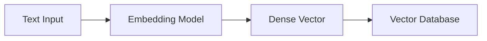

# Embedding Models

## Overview

Embedding models are machine learning models that convert text (or other data) into dense vector representations. These vectors capture semantic meaning, enabling similarity search in RAG systems.

In a RAG pipeline, embedding models are used for two key tasks:

- Converting document chunks into vectors (indexing)
- Converting user queries into vectors (retrieval)

---

## Why Embedding Models are Needed

Search based on keywords is limited.

Example:

Query:
```
How to reset password?
```

Keyword search might miss:
```
Account recovery instructions
Login issues guide
```

Embedding models solve this by understanding **meaning**, not just words.

---

## How Embedding Models Work



The model transforms text into a high-dimensional vector (e.g., 384, 768, 1536 dimensions).

---

## Example

Input:

```text
"I love AI engineering"
```

Output (simplified):

```text
[0.21, -0.87, 1.03, ..., 0.44]
```

This vector represents semantic meaning, not exact words.

---

## Key Property: Semantic Similarity

Similar texts produce similar vectors.

Example:

| Text | Relationship |
|------|-------------|
| "car" | close to "vehicle" |
| "dog" | close to "puppy" |
| "reset password" | close to "account recovery" |

---

## Types of Embedding Models

### 1. General-Purpose Embeddings

Used for most RAG systems.

Examples:
- OpenAI text-embedding models
- Sentence-BERT
- Cohere embeddings

Pros:
- Good general performance
- Easy to use

---

### 2. Domain-Specific Embeddings

Trained for specific domains:

- Legal
- Medical
- Code
- Finance

Pros:
- Better accuracy in specialized tasks
Cons:
- Limited generalization

---

### 3. Multilingual Embeddings

Support multiple languages in the same vector space.

Useful for:
- Global applications
- Cross-language search

---

## Where Embedding Models are Used in RAG

### Step 1: Indexing (Offline)

Documents are chunked and embedded:

```
Chunk → Embedding → Vector DB
```

---

### Step 2: Querying (Online)

User query is embedded:

```
Query → Embedding → Similarity Search
```

---

## Important Design Principle

> The same embedding model must be used for both documents and queries.

If different models are used:
- Vector spaces won't align
- Retrieval quality breaks

---

## Cosine Similarity (Core Operation)

Embeddings are compared using cosine similarity.

Formula:

```
similarity(A, B) = (A · B) / (|A| |B|)
```

Interpretation:

| Score | Meaning |
|------:|--------|
| 1.0 | identical meaning |
| 0.8 | highly similar |
| 0.5 | somewhat related |
| 0.0 | unrelated |

---

## Example Retrieval

Query:
```
How do I change my password?
```

Top matches:

1. "Password reset instructions"
2. "Account recovery steps"
3. "Login help guide"

Even if words differ, meaning is preserved.

---

## Python Example

Using `sentence-transformers`:

```python
from sentence_transformers import SentenceTransformer

model = SentenceTransformer("all-MiniLM-L6-v2")

texts = [
    "reset password instructions",
    "how to recover account",
    "AI engineering handbook"
]

embeddings = model.encode(texts)

print(embeddings.shape)
```

---

## Production Considerations

- Always use the same model for indexing and querying
- Store embeddings with metadata (source, timestamp, section)
- Normalize embeddings if required by similarity metric
- Monitor embedding drift when upgrading models
- Cache embeddings for frequently used queries

---

## Common Mistakes

### 1. Using different embedding models
→ breaks retrieval consistency

### 2. Embedding full documents instead of chunks
→ reduces precision

### 3. Not updating embeddings after model upgrade
→ causes silent quality degradation

### 4. Ignoring dimensionality
→ higher dimensions = better quality but higher cost

---

## Interview Answer (30 sec)

> Embedding models convert text into dense vectors that capture semantic meaning. In RAG systems, they are used to convert both document chunks and user queries into the same vector space so that similarity search can retrieve relevant information based on meaning rather than keywords.

---

## Interview Answer (2 min)

Embedding models are neural networks that map text into high-dimensional vector spaces where semantic similarity is preserved. In RAG systems, documents are first chunked and embedded offline, then stored in a vector database. At query time, the user input is embedded using the same model, and similarity search retrieves the most relevant document chunks.

This works because semantically similar texts are mapped to nearby points in vector space, allowing retrieval based on meaning rather than exact keyword matches. Consistency is critical—using different embedding models for indexing and querying leads to mismatched vector spaces and poor retrieval performance.

---

## Common Follow-up Questions

### Why do embeddings work for semantic search?

Because the model is trained to map similar meanings to nearby vectors in high-dimensional space.

---

### Can we use different embedding models for query and documents?

No. They must share the same vector space for meaningful comparison.

---

### What happens if embeddings are low quality?

Retrieval becomes noisy, leading to poor LLM responses.

---

### Why not just use keyword search?

Keyword search fails when wording differs even if meaning is the same.

---

## References

- Sentence-BERT (Reimers & Gurevych)
- OpenAI Embeddings Documentation
- Cohere Embedding Models
- Hugging Face Sentence Transformers
