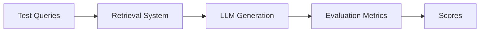

# RAG Evaluation

## Overview

RAG evaluation is the process of measuring how well a Retrieval-Augmented Generation system performs in terms of:

- Retrieval quality
- Answer correctness
- Context relevance
- Hallucination rate
- Latency and cost

Unlike traditional ML systems, RAG must evaluate **both retrieval and generation**, making it a multi-layer evaluation problem.

---

## Why RAG Evaluation is Hard

RAG systems are complex pipelines:

- Chunking
- Embedding
- Vector search
- Retrieval
- LLM generation

A failure in any step can degrade output quality.

So we cannot evaluate only the final answer—we must evaluate the entire system.

---

## What to Evaluate

### 1. Retrieval Quality

Did we retrieve the right documents?

Key metrics:
- Precision@K
- Recall@K
- Hit rate
- Mean Reciprocal Rank (MRR)

Example:
```
Query: "How to reset password?"

Relevant chunk:
✔ "Password reset instructions"

Retrieved:
✔ correct chunk in top 3 → good retrieval
```

---

### 2. Context Relevance

Are retrieved chunks actually useful for answering the question?

Bad case:
```
Query: password reset
Retrieved:
- billing policy
- marketing FAQ
```

Even if vector similarity is high, context is wrong.

---

### 3. Answer Correctness

Does the final LLM response correctly answer the question?

Approaches:
- Human evaluation
- LLM-as-a-judge
- Ground-truth comparison

---

### 4. Faithfulness (Hallucination Check)

Is the answer grounded in retrieved context?

Bad case:
- LLM adds information not present in retrieved documents

Good case:
- Answer strictly based on provided context

---

### 5. End-to-End Quality

Combines:
- retrieval quality
- generation quality

Example question:
```
Did the system answer the user correctly using correct sources?
```

---

### 6. Latency

Measures system performance:

- Embedding time
- Vector search time
- LLM inference time

Important for production chat systems.

---

## Evaluation Pipeline



---

## Offline Evaluation

Done before deployment using labeled datasets.

Dataset contains:
```
Query → Relevant documents → Expected answer
```

Used for:
- model comparison
- chunking tuning
- embedding evaluation

---

## Online Evaluation

Done in production using real user traffic.

Metrics include:
- user feedback (👍 👎)
- click-through rate
- session success rate
- re-query rate

---

## Common Evaluation Techniques

### 1. Ground Truth Matching

Compare system output with expected answer.

Good for:
- FAQs
- structured domains

---

### 2. LLM-as-a-Judge

Use another LLM to evaluate:

- correctness
- relevance
- hallucination

Example prompt:
```
Rate this answer from 1 to 5 based on correctness and relevance.
```

---

### 3. Human Evaluation

Most accurate but expensive.

Used for:
- high-stakes systems
- final validation

---

### 4. Retrieval Evaluation

Check if correct documents appear in top-K results.

Metrics:
- Recall@K
- Precision@K

---

## Common Failure Modes in RAG

### 1. Bad Chunking
→ irrelevant retrieval

---

### 2. Weak Embeddings
→ semantically wrong matches

---

### 3. Poor Retrieval Logic
→ noisy context

---

### 4. Context Overload
→ too many chunks exceed context window

---

### 5. Hallucination in LLM
→ model ignores retrieved context

---

## Improving RAG Based on Evaluation

If retrieval is weak:
- improve chunking
- change embedding model
- tune top-K

If generation is weak:
- improve prompt structure
- reduce noise in context
- add re-ranking

If hallucination exists:
- enforce grounding prompts
- add citation constraints
- reduce irrelevant context

---

## Production Considerations

- Always track retrieval metrics separately from generation metrics
- Maintain labeled evaluation datasets
- Monitor drift when updating embeddings or models
- Continuously A/B test retrieval strategies
- Log full RAG pipeline for debugging

---

## Interview Answer (30 sec)

> RAG evaluation measures how well a retrieval-augmented system performs across retrieval and generation stages. It includes evaluating retrieval quality (like Recall@K), answer correctness, faithfulness to context, and overall end-to-end performance, often using a combination of offline datasets, human evaluation, and LLM-based evaluators.

---

## Interview Answer (2 min)

RAG evaluation is a multi-layer process because the system consists of both retrieval and generation components. We evaluate retrieval quality using metrics like Recall@K and Precision@K to ensure relevant documents are being fetched. We also evaluate context relevance to ensure retrieved chunks are actually useful for answering the query.

For generation, we evaluate correctness, fluency, and faithfulness—ensuring the model’s answer is grounded in retrieved context and does not hallucinate. Evaluation can be done using offline labeled datasets, human review, or LLM-as-a-judge approaches.

In production systems, we also track online metrics like user feedback, re-query rates, and latency. Continuous evaluation helps improve chunking strategies, embedding models, retrieval logic, and prompt design.

---

## Common Follow-up Questions

### Why is RAG evaluation harder than traditional ML evaluation?

Because it involves multiple components (retrieval + generation), not just a single model output.

---

### What is Recall@K in RAG?

It measures how often the correct document appears in the top-K retrieved results.

---

### How do you detect hallucinations in RAG?

By checking if the generated answer is supported by retrieved context.

---

### Why use LLMs for evaluation?

They can approximate human judgment for correctness and relevance at scale.

---

## References

- Retrieval-Augmented Generation (Lewis et al., 2020)
- RAG Evaluation in LangChain / LlamaIndex Docs
- OpenAI Evals Framework
