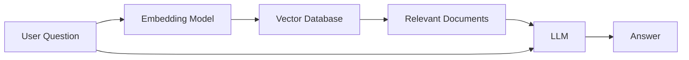

# Retrieval-Augmented Generation (RAG)

## Overview

Retrieval-Augmented Generation (RAG) is a technique that combines the reasoning capabilities of Large Language Models (LLMs) with external knowledge sources.

Instead of relying only on the information learned during training, a RAG system retrieves relevant documents from a knowledge base and includes them in the prompt before generating a response.

This allows AI applications to answer questions using up-to-date, domain-specific, or private information.

---

## Why is RAG Needed?

LLMs have several limitations:

- They only know what they learned during training.
- They may not have access to recent information.
- They cannot answer questions about your company's private documents.
- They can hallucinate when they don't know the answer.

RAG addresses these limitations by retrieving relevant information at query time.

---

## How RAG Works



The LLM receives both:

- The user's question
- The retrieved documents

It generates an answer based on both.

---

## Step-by-Step Workflow

### Step 1: Index Documents

Documents such as PDFs, manuals, or web pages are:

- Collected
- Split into smaller chunks
- Converted into embeddings
- Stored in a vector database

This is usually done offline.

---

### Step 2: User Asks a Question

Example:

```
How do I reset my password?
```

---

### Step 3: Embed the Query

The user's question is converted into an embedding using the same embedding model that was used for the documents.

---

### Step 4: Retrieve Relevant Documents

The vector database compares the query embedding with stored document embeddings and returns the most similar chunks.

Example:

```
Password Reset Guide

Account Recovery Instructions

Authentication FAQ
```

---

### Step 5: Generate the Answer

The application builds a prompt containing:

- System prompt
- User question
- Retrieved documents

The LLM generates a response using this additional context.

---

## Example

Knowledge Base:

```
Employee Handbook

Vacation Policy

Benefits Guide

Engineering Wiki
```

User asks:

```
How many vacation days do employees receive?
```

Without RAG:

The model may guess or hallucinate.

With RAG:

The vacation policy is retrieved and included in the prompt, allowing the model to answer accurately.

---

## Benefits of RAG

- Uses private company data
- Supports up-to-date information
- Reduces hallucinations
- No need to retrain the model
- Easier to maintain than fine-tuning

---

## Limitations

- Retrieval quality affects answer quality.
- Poor chunking leads to poor retrieval.
- Incorrect or outdated documents produce incorrect answers.
- Additional retrieval step increases latency.

---

## Common RAG Components

A typical RAG pipeline includes:

- Document Loader
- Chunking
- Embedding Model
- Vector Database
- Retriever
- Prompt Builder
- Large Language Model

---

## RAG vs Fine-Tuning

| RAG | Fine-Tuning |
|------|-------------|
| Uses external knowledge | Updates model weights |
| No retraining required | Requires training |
| Easy to update documents | Must retrain for new knowledge |
| Ideal for changing information | Ideal for changing model behavior |

---

## Production Considerations

When building RAG systems:

- Use consistent embedding models for indexing and querying.
- Choose an appropriate chunk size.
- Retrieve only the most relevant documents.
- Monitor retrieval quality and latency.
- Keep the knowledge base up to date.

---

## Interview Answer (30 sec)

> Retrieval-Augmented Generation, or RAG, combines an LLM with an external knowledge base. When a user asks a question, the application retrieves relevant documents using vector similarity search and includes them in the prompt. This enables the model to answer using current, private, or domain-specific information without retraining.

---

## Interview Answer (2 min)

RAG extends an LLM by adding a retrieval layer. Documents are first chunked, embedded, and stored in a vector database. When a user submits a query, the application embeds the query using the same embedding model and retrieves the most relevant document chunks through similarity search.

These retrieved documents are added to the prompt, giving the LLM additional context before generating a response. This approach improves factual accuracy, supports proprietary data, and avoids the cost of retraining whenever the underlying knowledge changes.

---

## Common Follow-up Questions

### Why not fine-tune the model?

Fine-tuning changes the model's behavior, while RAG supplies external knowledge. If the information changes frequently, updating documents is much easier than retraining.

---

### Why use embeddings?

Embeddings enable semantic search, allowing retrieval of relevant documents even when the query uses different wording.

---

### Can RAG eliminate hallucinations?

No.

RAG reduces hallucinations by providing relevant context, but the model can still misinterpret or fabricate information.

---

### Why split documents into chunks?

Because embedding entire documents often reduces retrieval quality and can exceed context window limits.

---

## References

- Retrieval-Augmented Generation for Knowledge-Intensive NLP Tasks (Lewis et al., 2020)
- LangChain Documentation
- LlamaIndex Documentation
- Hugging Face RAG Guide
