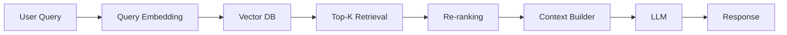
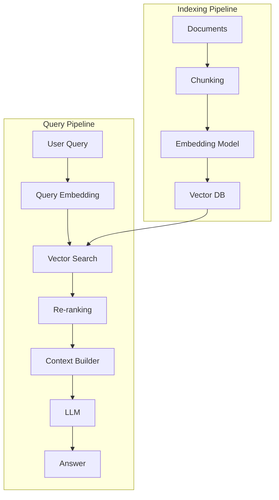

# RAG System Design (End-to-End)

## Overview

A RAG (Retrieval-Augmented Generation) system is an architecture that combines:

- Document processing (chunking + embedding)
- Retrieval system (vector database + similarity search)
- Ranking layer (optional re-ranking)
- LLM generation

The goal is to allow LLMs to answer questions using **external, up-to-date, or private knowledge**.

---

## High-Level Architecture



---

## Offline Pipeline (Indexing Phase)

This runs when documents are added or updated.

### Step 1: Data Ingestion
Sources:
- PDFs
- Web pages
- Databases
- Internal docs (Confluence, Notion, etc.)

---

### Step 2: Chunking
Documents are split into smaller pieces.

Goal:
- preserve meaning
- fit embedding limits
- improve retrieval precision

---

### Step 3: Embedding
Each chunk is converted into a vector using an embedding model.

```
Chunk → Embedding Vector
```

---

### Step 4: Indexing in Vector DB
Store:

```
(vector, metadata, original text)
```

Metadata includes:
- document source
- section title
- timestamp
- permissions

---

## Online Pipeline (Query Phase)

This runs when a user asks a question.

---

### Step 1: Query Embedding
User query is converted into a vector.

```
"What is password reset process?"
→ vector
```

---

### Step 2: Similarity Search
Vector DB retrieves top-K relevant chunks.

Example:
```
1. Password reset policy
2. Account recovery guide
3. Login troubleshooting
```

---

### Step 3: Re-ranking (Optional but common)
A stronger model refines results:

- removes noise
- improves ordering
- increases relevance

Output:
```
1. Password reset policy
2. Account recovery guide
```

---

### Step 4: Context Building
Retrieved chunks are formatted into a structured prompt.

Example:

```
Context:
- Password reset takes 5 minutes...
- Users must verify email...

Question:
How do I reset my password?
```

---

### Step 5: LLM Generation
The LLM uses:
- user query
- retrieved context

to generate a grounded response.

---

## Full RAG Flow



---

## Key Design Decisions

### 1. Chunk Size
Impacts:
- retrieval precision
- context quality

Trade-off:
- small chunks → precise but fragmented
- large chunks → more context but noisy

---

### 2. Embedding Model Choice
Must be:
- consistent across indexing + query
- optimized for semantic similarity

---

### 3. Top-K Retrieval
Controls:
- recall
- latency
- prompt size

---

### 4. Re-ranking Usage
Improves accuracy but adds latency.

Used when:
- quality matters more than speed
- enterprise or high-value use cases

---

### 5. Context Window Constraints
Must ensure:

```
retrieved tokens + prompt + response ≤ model limit
```

---

## Failure Modes in RAG Systems

### 1. Bad Retrieval
Cause:
- poor embeddings
- bad chunking

Effect:
- irrelevant context → wrong answers

---

### 2. Context Overload
Cause:
- too many chunks

Effect:
- LLM gets confused or truncated

---

### 3. Hallucination
Cause:
- missing or weak context

Effect:
- model invents answers

---

### 4. Stale Knowledge
Cause:
- outdated documents

Effect:
- incorrect but confident answers

---

## Production Optimizations

### 1. Caching
- embedding cache
- query result cache

---

### 2. Hybrid Search
Combine:
- keyword search (BM25)
- vector search

---

### 3. Metadata Filtering
Example:
- department = "HR"
- region = "US"

---

### 4. Streaming Responses
Improves perceived latency.

---

### 5. Observability
Track:
- retrieval latency
- top-K accuracy
- user feedback
- hallucination rate

---

## Real-World Use Cases

- Enterprise knowledge assistants
- Customer support bots
- Legal document search
- Code assistants
- Internal engineering copilots

---

## Interview Answer (30 sec)

> A RAG system combines retrieval and generation by first converting documents into embeddings, storing them in a vector database, retrieving relevant chunks based on a user query, optionally re-ranking them, and then passing them as context to an LLM to generate grounded responses.

---

## Interview Answer (2 min)

A RAG system consists of two pipelines: an offline indexing pipeline and an online query pipeline. In the offline phase, documents are ingested, chunked, converted into embeddings, and stored in a vector database with metadata. In the online phase, a user query is embedded and used to retrieve top-K similar chunks from the vector database. These chunks may be re-ranked to improve relevance and then formatted into a structured prompt.

The LLM receives both the user query and the retrieved context to generate an answer grounded in external knowledge. This architecture improves factual accuracy, enables use of private data, and avoids retraining the model for every knowledge update.

---

## Common Follow-up Questions

### Why is RAG better than fine-tuning?

Because it allows dynamic updates to knowledge without retraining the model.

---

### What are the biggest bottlenecks in RAG systems?

- retrieval quality
- context window limits
- latency from multiple stages

---

### Where do most RAG failures happen?

Usually in:
- chunking
- embedding mismatch
- poor retrieval logic

---

### How do you improve RAG quality?

- better chunking strategy
- better embeddings
- re-ranking
- hybrid search
- evaluation loops

---

## References

- Retrieval-Augmented Generation (Lewis et al., 2020)
- LangChain RAG Architecture
- LlamaIndex Documentation
- Pinecone RAG Guides
