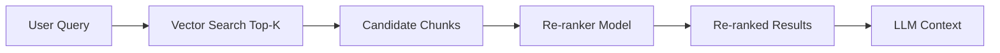
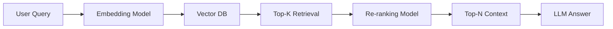

# Re-ranking

## Overview

Re-ranking is the process of refining the initial set of retrieved documents to improve relevance before passing them to the LLM.

In a RAG system, vector search retrieves a broad set of candidates (top-K), but not all of them are equally useful. Re-ranking improves the ordering using more precise scoring methods.

---

## Why Re-ranking is Needed

Vector search is fast but imperfect.

It may return:
- semantically similar but irrelevant chunks
- partially related content
- noisy results

Example:

Query:
```
How do I reset my password?
```

Vector search returns:
```
1. Password reset guide ✔
2. Account recovery steps ✔
3. Billing FAQ ❌
4. Marketing onboarding doc ❌
```

Re-ranking ensures only the most relevant chunks are prioritized.

---

## How Re-ranking Works



---

## Step-by-Step Process

### Step 1: Retrieve Candidates

Vector DB retrieves top-K results (e.g., K = 20 or 50):

```
Chunk 1
Chunk 2
...
Chunk 20
```

---

### Step 2: Score Relevance

A re-ranking model evaluates each chunk against the query.

It assigns a relevance score:

| Chunk | Score |
|------|------:|
| Password reset guide | 0.95 |
| Account recovery steps | 0.91 |
| Billing FAQ | 0.32 |

---

### Step 3: Sort by Score

Chunks are reordered based on relevance:

```
1. Password reset guide
2. Account recovery steps
3. Login troubleshooting
```

---

### Step 4: Select Top-N

Only the best chunks are sent to the LLM:

```
Top 3–5 chunks typically
```

---

## Types of Re-ranking

### 1. Cross-Encoder Models (Most Common)

A transformer reads:

```
[Query + Document] → Relevance Score
```

Pros:
- Very accurate
- Strong semantic understanding

Cons:
- Slower than vector search
- Expensive at scale

---

### 2. LLM-based Re-ranking

Use an LLM to score or rank documents.

Example prompt:
```
Rank these documents by relevance to the question.
```

Pros:
- High quality
- Flexible reasoning

Cons:
- High latency and cost

---

### 3. Heuristic Re-ranking

Rule-based scoring:

- keyword overlap
- recency boost
- metadata priority

Pros:
- Fast
- Cheap

Cons:
- Limited semantic understanding

---

## Why Re-ranking Works

Vector search is good at:
- “finding similar meaning”

But weak at:
- fine-grained relevance judgment

Re-ranking adds:
- deeper semantic understanding
- contextual reasoning
- disambiguation between similar results

---

## RAG Pipeline with Re-ranking



---

## Example

### Query:
```
How do I reset my password?
```

### Vector Search Output:
```
1. Password reset guide
2. Account recovery steps
3. Login troubleshooting
4. Billing FAQ
```

### After Re-ranking:
```
1. Password reset guide
2. Account recovery steps
3. Login troubleshooting
```

Irrelevant content is removed.

---

## Trade-offs

| Benefit | Cost |
|--------|------|
| Higher accuracy | Extra latency |
| Better relevance | More compute |
| Reduced hallucinations | More complexity |

---

## Production Considerations

- Use re-ranking only after initial vector filtering
- Limit candidate pool (e.g., top 20–100)
- Keep final context small (top 3–10 chunks)
- Cache frequent query rankings
- Balance latency vs accuracy carefully

---

## Common Mistakes

### 1. Re-ranking too many documents
→ increases latency significantly

---

### 2. Skipping vector search
→ re-ranking alone does not scale

---

### 3. Passing too many chunks to LLM
→ increases hallucination risk

---

### 4. Not tuning top-K and top-N separately
→ poor performance trade-off

---

## When to Use Re-ranking

Use re-ranking when:

- accuracy matters more than latency
- queries are complex or ambiguous
- vector search returns noisy results
- enterprise or high-value applications

Skip re-ranking when:

- latency is critical (real-time chat)
- dataset is small and clean
- simple FAQ systems

---

## Interview Answer (30 sec)

> Re-ranking is a step in RAG that refines the initial results from vector search by using a more precise model to reorder or filter documents based on relevance to the query. It improves retrieval quality by ensuring only the most relevant chunks are passed to the LLM.

---

## Interview Answer (2 min)

Re-ranking is used in RAG systems to improve the quality of retrieved documents. After vector search retrieves a set of candidate chunks (top-K), a re-ranking model evaluates each candidate against the query and assigns a relevance score. These scores are then used to reorder or filter the results before passing them to the LLM.

Unlike vector search, which is optimized for speed and approximate similarity, re-ranking uses more computationally expensive models like cross-encoders or even LLMs to perform fine-grained relevance judgments. This improves retrieval precision and reduces noise in the final context, leading to better LLM responses.

---

## Common Follow-up Questions

### Why not use re-ranking only?

Because it is too slow and expensive for large-scale search.

---

### What is the difference between vector search and re-ranking?

Vector search finds candidates quickly; re-ranking refines them accurately.

---

### What models are used for re-ranking?

Cross-encoders, LLMs, or heuristic scoring systems.

---

### Does re-ranking always improve RAG performance?

Yes in accuracy, but not always in latency-sensitive systems.

---

## References

- Sentence-BERT Cross-Encoders
- Cohere Re-ranking Models
- ColBERT (Contextualized Late Interaction)
- RAG Architecture Papers
