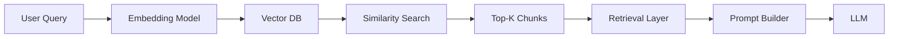

# Retrieval in RAG

## Overview

Retrieval is the process of selecting and assembling relevant information from a knowledge base (usually a vector database) to provide context to an LLM.

It sits between:
- similarity search (finding candidates)
- LLM generation (producing answer)

Retrieval is what turns “top-K vectors” into a **usable prompt context**.

---

## Why Retrieval is Needed

Similarity search alone returns raw chunks.

But LLMs need:

- structured input
- limited tokens
- relevant + ordered context
- noise-free information

Retrieval is responsible for transforming raw search results into a clean context window.

---

## How Retrieval Works



---

## Step-by-Step Process

### Step 1: Query Embedding
User query is converted into a vector.

---

### Step 2: Similarity Search
Vector DB returns top-K similar chunks.

Example:
```
1. Password reset policy
2. Account recovery guide
3. Login troubleshooting
```

---

### Step 3: Filtering (optional but common)

Remove:
- low relevance chunks
- duplicates
- outdated content
- irrelevant sections

---

### Step 4: Ranking / Ordering

Chunks are ordered by:
- similarity score
- document importance
- recency (optional)
- metadata priority

---

### Step 5: Context Assembly

Chunks are formatted into a structured prompt:

```text
Context:
1. Password reset takes 5–7 minutes...
2. Account recovery requires email verification...

Question:
How do I reset my password?
```

---

## Types of Retrieval

### 1. Naive Retrieval

- Just top-K similarity search
- No filtering or ordering

Simple but weak quality.

---

### 2. Filtered Retrieval

Applies metadata filters:

- department = "HR"
- date > 2024
- document type = "policy"

---

### 3. Structured Retrieval

Retrieval respects document structure:

- headings
- sections
- tables
- hierarchy

Improves LLM understanding.

---

### 4. Hybrid Retrieval

Combines:
- keyword search (BM25)
- vector search

Best of both worlds.

---

## Retrieval vs Similarity Search

| Similarity Search | Retrieval |
|------------------|-----------|
| Finds candidates | Builds final context |
| Returns raw chunks | Prepares LLM input |
| Vector-level | Application-level |
| Unstructured | Structured |

---

## Example

Query:
```
How do I reset my password?
```

Similarity Search Output:
```
Chunk A
Chunk B
Chunk C
```

Retrieval Output:
```
Context:
- Step-by-step password reset instructions
- Account recovery rules
- Security verification steps
```

---

## Context Window Constraints

Retrieval must consider:

- token limits
- number of chunks
- chunk size
- LLM context window

So retrieval often includes:

- truncation
- summarization
- prioritization

---

## Production Considerations

- Always limit number of chunks passed to LLM
- Deduplicate similar chunks
- Use metadata filters aggressively
- Keep retrieval latency low
- Balance recall vs precision
- Ensure deterministic formatting

---

## Common Mistakes

### 1. Passing raw search results directly to LLM
→ leads to noisy prompts

---

### 2. Too many chunks
→ exceeds context window

---

### 3. No ranking strategy
→ irrelevant context included

---

### 4. Ignoring structure
→ LLM gets unorganized text

---

## Interview Answer (30 sec)

> Retrieval in RAG is the process of converting similarity search results into structured context for the LLM. It includes filtering, ranking, and formatting the retrieved chunks so that only relevant, well-organized information is passed into the model for generation.

---

## Interview Answer (2 min)

Retrieval is the layer in a RAG system that sits between vector similarity search and LLM generation. After the vector database returns top-K similar chunks, the retrieval layer filters, ranks, and formats these chunks into a structured context window.

This step ensures that the LLM receives only relevant, non-redundant, and properly ordered information. It may involve metadata filtering, deduplication, ordering by relevance or recency, and truncation to fit within context limits. Without proper retrieval logic, even a good embedding and vector search system can produce poor LLM outputs due to noisy or irrelevant context.

---

## Common Follow-up Questions

### Why not send raw vector search results to LLM?

Because raw results may be unstructured, redundant, or irrelevant.

---

### What is the difference between retrieval and search?

Search finds candidates; retrieval prepares final LLM-ready context.

---

### Why is formatting important in retrieval?

LLMs perform better when context is structured and ordered.

---

### Does retrieval affect hallucination?

Yes. Better retrieval reduces hallucination by improving input quality.

---

## References

- Retrieval-Augmented Generation (Lewis et al., 2020)
- LangChain Retrieval Concepts
- LlamaIndex Retrieval Pipelines
