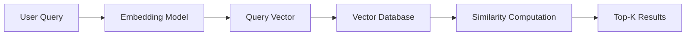
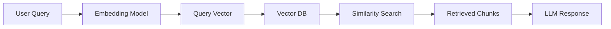

# Similarity Search

## Overview

Similarity search is the process of finding vectors (embeddings) that are closest to a given query vector in a vector database.

In RAG systems, it is the core mechanism used to retrieve relevant document chunks based on meaning rather than keywords.

---

## Why Similarity Search is Needed

Traditional search systems rely on exact keyword matches.

Example:

Query:
```
How do I reset my password?
```

Keyword search may fail if documents use different wording like:
- "account recovery"
- "login assistance"
- "credentials reset"

Similarity search solves this by comparing **meaning in vector space**.

---

## How Similarity Search Works



Steps:
1. Convert query into embedding vector
2. Compare it with stored document vectors
3. Rank results by similarity score
4. Return top-K most relevant chunks

---

## Core Idea

Each document chunk and query is represented as a vector:

```text
Query Vector → q
Document Vector → d
```

We compute similarity between `q` and `d`.

---

## Common Similarity Metrics

### 1. Cosine Similarity ⭐ (Most common)

Measures angle between vectors.

```text
similarity(q, d) = (q · d) / (|q| |d|)
```

Interpretation:

| Score | Meaning |
|------:|--------|
| 1.0 | identical meaning |
| 0.8 | very similar |
| 0.5 | somewhat related |
| 0.0 | unrelated |

---

### 2. Dot Product

Measures alignment and magnitude.

Used when:
- vectors are normalized
- or magnitude carries meaning

---

### 3. Euclidean Distance

Measures straight-line distance between vectors.

```text
smaller distance → more similar
```

Less common in modern RAG systems.

---

## Example

Query:
```
How to change my password?
```

Candidate documents:

| Document | Similarity Score |
|----------|-----------------|
| Password reset guide | 0.92 |
| Account recovery steps | 0.88 |
| Billing FAQ | 0.21 |

Top-K results:
```
1. Password reset guide
2. Account recovery steps
```

---

## Top-K Retrieval

Vector databases return the **top K most similar results**.

Example:

```
K = 5
```

Returns the 5 most relevant chunks.

Choosing K is a trade-off:

| Small K | Large K |
|--------|--------|
| Faster | More context |
| Higher precision | More recall |
| Risk missing info | Risk noise |

---

## Similarity Search in RAG Pipeline



Similarity search is the retrieval step between query embedding and LLM generation.

---

## Why Cosine Similarity Works Well

Cosine similarity focuses on **direction**, not magnitude.

This is useful because:

- Embeddings represent meaning directionally
- Magnitude can vary based on sentence length
- We care about semantic similarity, not size

---

## Production Considerations

- Always normalize embeddings if using cosine similarity
- Use ANN (Approximate Nearest Neighbor) for scalability
- Cache frequent queries
- Tune K based on latency vs quality trade-offs
- Combine with metadata filtering for better relevance

---

## Common Mistakes

### 1. Using raw dot product without normalization
→ leads to biased similarity scores

---

### 2. Choosing wrong similarity metric
→ reduces retrieval quality

---

### 3. Setting K too high
→ introduces irrelevant context into LLM prompt

---

### 4. Ignoring embedding quality
→ similarity search is only as good as embeddings

---

## Interview Answer (30 sec)

> Similarity search is the process of finding document vectors closest to a query vector using metrics like cosine similarity. It is used in RAG systems to retrieve semantically relevant information from a vector database based on meaning rather than keywords.

---

## Interview Answer (2 min)

Similarity search compares a query embedding with stored document embeddings to find the most relevant matches. This is done using similarity metrics such as cosine similarity, dot product, or Euclidean distance. In modern RAG systems, cosine similarity combined with Approximate Nearest Neighbor (ANN) search is most commonly used for efficiency and scalability.

The system embeds the user query, compares it against stored vectors in a vector database, and retrieves the top-K most similar results. These results are then passed to the LLM as context for generation. This enables semantic search, allowing systems to retrieve relevant information even when exact keywords do not match.

---

## Common Follow-up Questions

### Why is cosine similarity preferred?

Because it measures semantic similarity based on direction rather than magnitude.

---

### What is top-K in similarity search?

It refers to retrieving the K most similar documents to a query.

---

### How does similarity search scale to large datasets?

Using Approximate Nearest Neighbor algorithms like HNSW or IVF.

---

### Is similarity search enough for good RAG performance?

No. It must be combined with good chunking, embeddings, and sometimes re-ranking.

---

## References

- FAISS Documentation
- Pinecone Vector Search Guide
- Sentence-BERT Paper
- Approximate Nearest Neighbor Search Research
