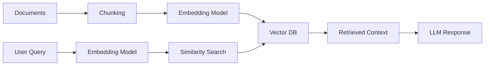

# Vector Databases

## Overview

A vector database is a specialized database designed to store, index, and search high-dimensional embedding vectors efficiently.

In a RAG system, vector databases enable fast **semantic search** over millions of document chunks.

Instead of searching by keywords, vector databases search by **similarity in embedding space**.

---

## Why Vector Databases are Needed

Traditional databases (SQL / NoSQL) are not designed for vector similarity search.

Example limitation:

- SQL is good for:
  - Exact matches
  - Filters
  - Structured queries

- But poor at:
  - "Find similar meaning"
  - "Semantic search"

Vector databases solve this problem.

---

## How Vector Databases Work


Each document chunk is converted into a vector and stored in an index optimized for fast similarity search.

---

## Core Idea

A vector database stores:

```text
(vector, metadata)
```

Example:

```text
[
  [0.12, -0.44, 0.88, ...] → "Password reset guide",
  [0.91, 0.03, -0.22, ...] → "Billing FAQ"
]
```

Metadata may include:
- document title
- section
- timestamp
- source URL

---

## What Happens During Search

### Step 1: User Query

```text
How do I reset my password?
```

---

### Step 2: Convert to Embedding

```text
Query → Vector
```

---

### Step 3: Similarity Search

The database compares query vector with stored vectors using:

- Cosine similarity
- Dot product
- Euclidean distance

---

### Step 4: Return Top-K Matches

Example result:

1. "Password reset instructions"
2. "Account recovery steps"
3. "Login troubleshooting guide"

---

## Indexing Techniques

Vector databases use specialized indexing structures for fast search:

### 1. Brute Force (Naive)

- Compare query vector with all vectors
- Accurate but slow

---

### 2. Approximate Nearest Neighbor (ANN) ⭐

Used in production systems.

Algorithms include:
- HNSW (Hierarchical Navigable Small World graphs)
- IVF (Inverted File Index)
- PQ (Product Quantization)

Trade-off:
- Slightly less accurate
- Much faster at scale

---

## Popular Vector Databases

### 1. FAISS (Facebook AI Similarity Search)

- Library, not a full database
- Very fast
- Used for research + production prototypes

---

### 2. Pinecone

- Fully managed vector database
- Scales automatically
- Easy to integrate

---

### 3. Weaviate

- Open-source vector database
- Supports hybrid search (keyword + vector)

---

### 4. Milvus

- Highly scalable open-source system
- Used in enterprise AI systems

---

### 5. Chroma

- Lightweight vector database
- Popular for local development

---

## Vector DB in RAG Pipeline



---

## Why Vector Databases Scale Well

They are optimized for:

- High-dimensional data (e.g., 384–3072 dims)
- Millions to billions of vectors
- Fast nearest-neighbor search
- Low-latency retrieval

---

## Key Concepts

### 1. Top-K Search

Return the top K most similar vectors.

Example:
```
K = 5 → return top 5 matches
```

---

### 2. Similarity Metrics

Common metrics:

- Cosine similarity (most common)
- Dot product
- Euclidean distance

---

### 3. Metadata Filtering

Vector search can be combined with filters:

Example:
```
Find similar documents
WHERE department = "HR"
```

---

## Production Considerations

- Always store metadata with embeddings
- Choose ANN index based on scale and latency needs
- Monitor retrieval latency
- Periodically rebuild indexes for large datasets
- Ensure embedding model consistency

---

## Common Mistakes

### 1. Using exact search instead of ANN
→ does not scale

### 2. Not normalizing embeddings (when required)
→ reduces similarity accuracy

### 3. Mixing embedding models
→ corrupts vector space consistency

### 4. Ignoring metadata filtering
→ reduces retrieval relevance

---

## Interview Answer (30 sec)

> A vector database is a system designed to store and search embedding vectors efficiently. It enables semantic search by finding documents whose embeddings are closest to a query embedding using similarity metrics like cosine similarity. It is a core component of RAG systems.

---

## Interview Answer (2 min)

Vector databases are specialized storage systems optimized for high-dimensional embedding vectors. In RAG systems, documents are first chunked and embedded, then stored in a vector database along with metadata. When a query arrives, it is embedded using the same model, and the vector database performs a similarity search to retrieve the most relevant chunks.

Unlike traditional databases that rely on exact matches, vector databases use approximate nearest neighbor algorithms such as HNSW or IVF to efficiently search large-scale datasets. This enables fast semantic search across millions or even billions of vectors while maintaining low latency.

---

## Common Follow-up Questions

### Why not use SQL databases?

Because SQL is optimized for structured queries, not similarity search in high-dimensional spaces.

---

### What is ANN search?

Approximate Nearest Neighbor search is a technique that trades a small amount of accuracy for significant speed improvements.

---

### Why is cosine similarity commonly used?

It measures the angle between vectors, making it robust to magnitude differences.

---

### How does a vector DB scale to billions of vectors?

Using ANN indexes like HNSW, IVF, and product quantization.

---

## References

- FAISS (Facebook AI Similarity Search)
- Pinecone Documentation
- Weaviate Docs
- Milvus Documentation
- Approximate Nearest Neighbor Search Research Papers
