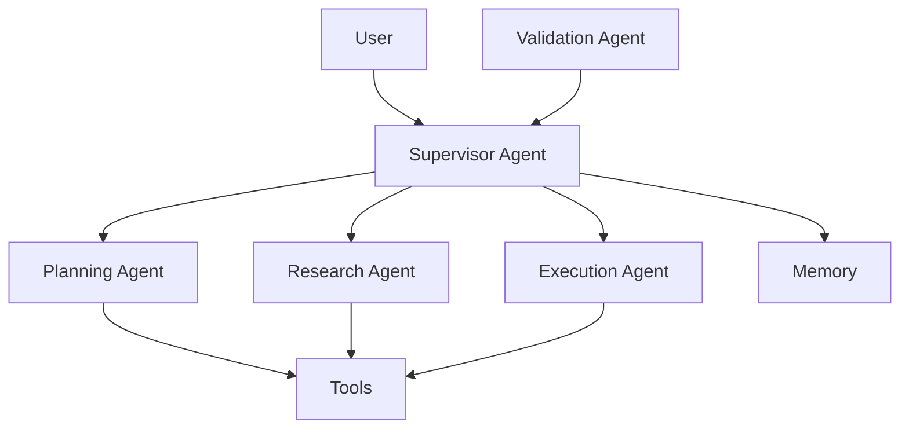

# Multi-Agent System Design

## Overview

A multi-agent system consists of multiple specialized AI agents that collaborate to solve complex tasks.

Instead of one general-purpose agent handling everything, responsibilities are distributed across multiple agents with specific roles.

Example:

A travel assistant can have:

```
User Request

↓

Supervisor Agent

↓

+----------------+
|                |
v                v

Flight Agent   Hotel Agent

+----------------+

↓

Itinerary Agent

↓

Final Response
```

---

# Why Use Multi-Agent Systems?

A single agent can become difficult to manage when tasks require:

- Multiple domains
- Different tools
- Complex reasoning
- Parallel execution
- Specialized knowledge

Multi-agent systems improve:

- Modularity
- Scalability
- Maintainability
- Task specialization

---

# Single Agent vs Multi-Agent

## Single Agent

Architecture:

```
User

↓

LLM Agent

↓

Tools

↓

Response
```

Advantages:

- Simple
- Lower latency
- Easier debugging

Limitations:

- Large prompts
- Complex reasoning
- Difficult tool selection

---

## Multi-Agent

Architecture:

```
User

↓

Supervisor Agent

↓

Specialist Agents

↓

Tools

↓

Response
```

Advantages:

- Specialized intelligence
- Better task decomposition
- Independent scaling

Limitations:

- More complexity
- Higher latency
- More coordination challenges

---

# Multi-Agent Architecture



---

# Core Components

## 1. Supervisor Agent

The supervisor coordinates the workflow.

Responsibilities:

- Understand user goal
- Break tasks into subtasks
- Route requests
- Manage agent communication
- Combine results

Example:

User:

```
Create a market analysis report.
```

Supervisor:

```
1. Ask research agent for data
2. Ask analysis agent for insights
3. Ask writing agent for report
```

---

# 2. Specialist Agents

Each agent focuses on a specific capability.

Examples:

## Research Agent

Responsibilities:

- Search information
- Retrieve documents
- Gather data

---

## Coding Agent

Responsibilities:

- Generate code
- Review code
- Run tests

---

## Data Analysis Agent

Responsibilities:

- Analyze datasets
- Generate insights

---

## Writing Agent

Responsibilities:

- Summarize
- Format output
- Create reports

---

# 3. Agent Communication

Agents need a communication pattern.

Common approaches:

---

# Pattern 1: Supervisor Pattern

Most common enterprise pattern.

Architecture:

```
              User

               |

               v

        Supervisor Agent

        /      |       \

       v       v        v

 Research   Coding   Writing

       \       |       /

        Supervisor

               |

               v

            Response
```

The supervisor controls everything.

Benefits:

- Easy control
- Better observability
- Clear ownership

---

# Pattern 2: Peer-to-Peer

Agents communicate directly.

Example:

```
Research Agent

       |

       v

Analysis Agent

       |

       v

Writing Agent
```

Benefits:

- Flexible

Challenges:

- Harder debugging
- Complex coordination

---

# Pattern 3: Hierarchical Agents

Agents manage other agents.

Example:

```
Manager Agent

↓

Team Lead Agent

↓

Worker Agents
```

Useful for:

- Large workflows
- Enterprise automation

---

# Agent Workflow Example

## Customer Support System

User:

```
My payment failed.
```

---

Supervisor:

```
Need payment troubleshooting.
```

Routes to:

```
Payment Agent
```

---

Payment Agent:

```
Checks transaction history.

Calls:

- Payment API
- Customer database
```

---

Response Agent:

```
Creates customer-friendly explanation.
```

---

# Agent State Management

Multi-agent systems require shared state.

Example:

```json
{
 "customer_id": "123",

 "issue": "payment failure",

 "investigation": {
   "transaction_status": "failed",
   "error_code": "402"
 },

 "next_step": "generate_response"
}
```

---

# Memory in Multi-Agent Systems

Agents can share:

## Shared Memory

All agents access common memory.

Example:

```
Customer Profile

↓

All agents
```

---

## Private Memory

Each agent maintains its own memory.

Example:

```
Research Agent Memory

Coding Agent Memory
```

---

## Long-Term Memory

Stores historical interactions.

Example:

```
Customer prefers email communication.
```

---

# Tool Usage

Agents can have different tools.

Example:

```
Research Agent

Tools:
- Web Search
- RAG


Coding Agent

Tools:
- GitHub
- IDE
- Testing


Support Agent

Tools:
- CRM
- Database
```

---

# LangGraph Multi-Agent Architecture

LangGraph models agents as nodes in a graph.

Example:

```
              START

                |

                v

          Supervisor Node

          /       |       \

         v        v        v

    Research   Coding   Review

          \       |       /

                v

              END
```

Components:

- Nodes = Agents
- Edges = Routing logic
- State = Shared information

---

# Multi-Agent Design Patterns

## Sequential Pattern

Agents execute one after another.

Example:

```
Research

↓

Analysis

↓

Writing
```

---

## Parallel Pattern

Agents execute simultaneously.

Example:

```
          Supervisor

          /        \

 Research        Search

          \        /

             Merge
```

Benefits:

- Faster execution

---

## Debate Pattern

Agents review each other's work.

Example:

```
Generator Agent

↓

Reviewer Agent

↓

Improvement Agent
```

Useful for:

- Quality improvement
- Complex reasoning

---

# Production Architecture

```mermaid
flowchart TD

User

↓

API Gateway

↓

Agent Orchestrator

↓

Supervisor Agent

↓

+---------------+
|               |
v               v

Specialist     Memory
Agents

|

v

Tools / APIs / RAG

|

v

Response

```

---

# Reliability Considerations

## Agent Failure

Problem:

```
Research Agent unavailable
```

Solutions:

- Retry
- Fallback agents
- Timeout handling

---

## Infinite Loops

Problem:

```
Agent A calls Agent B

Agent B calls Agent A
```

Solutions:

- Maximum steps
- State tracking
- Execution limits

---

## Incorrect Delegation

Problem:

```
Wrong agent selected
```

Solutions:

- Better routing prompts
- Classification models
- Evaluation

---

# Security Considerations

Multi-agent systems introduce additional risks.

## Tool Permissions

Each agent should have limited access.

Example:

```
Research Agent:

Read only
```

```
Deployment Agent:

Requires approval
```

---

## Agent Isolation

Prevent one compromised agent from affecting others.

---

## Audit Logging

Track:

- Agent decisions
- Tool calls
- Data access
- Final outputs

---

# Evaluation Metrics

Measure:

## Task Completion

Did the system solve the task?

---

## Agent Routing Accuracy

Was the correct agent selected?

---

## Tool Success Rate

Were tools used correctly?

---

## Cost

Measure:

- Token usage
- Model calls
- Latency

---

## Quality

Evaluate:

- Accuracy
- Completeness
- User satisfaction

---

# Common Multi-Agent Frameworks

## LangGraph

Used for:

- Stateful workflows
- Agent orchestration
- Human approval flows

---

## AutoGen

Used for:

- Agent conversations
- Collaboration patterns

---

## CrewAI

Used for:

- Role-based agents
- Task delegation

---

# Interview Answer (30 seconds)

> A multi-agent system divides complex tasks among specialized agents coordinated by an orchestrator or supervisor agent. Each agent has a specific role, tools, and responsibilities. The supervisor manages planning, routing, and combining results. Production systems require shared state management, memory, security controls, evaluation, and observability.

---

# Interview Answer (2 minutes)

When designing a multi-agent system, I start with task decomposition. Instead of having one agent handle every responsibility, I create specialized agents such as research, execution, validation, and response agents.

A supervisor agent manages routing and coordination. Agents communicate through shared state, and each agent has access only to the tools required for its role. Frameworks like LangGraph represent this as a stateful graph where agents are nodes and transitions define workflow.

For production systems, I focus on reliability, security, observability, evaluation, and cost control. Important considerations include preventing infinite loops, controlling tool permissions, tracking agent decisions, and measuring task completion quality.

---

# Common Interview Questions

## Why use multiple agents instead of one?

To improve specialization, modularity, and complex task handling.

---

## What is a supervisor agent?

A coordinator agent that plans tasks, routes requests, and manages specialist agents.

---

## How do agents share information?

Through:

- Shared state
- Memory systems
- Message passing
- Databases

---

## What are challenges with multi-agent systems?

- Coordination complexity
- Higher cost
- Debugging difficulty
- Security risks
- Latency

---

## How do you evaluate a multi-agent system?

Measure:

- Task completion
- Routing accuracy
- Tool usage
- Response quality
- Cost
- Latency

---

# Key Takeaways

- Multi-agent systems use specialized agents coordinated by an orchestrator.
- Supervisor patterns are common in enterprise systems.
- LangGraph provides a stateful approach for agent workflows.
- Memory and tools are shared capabilities.
- Production systems require security, evaluation, and observability.
